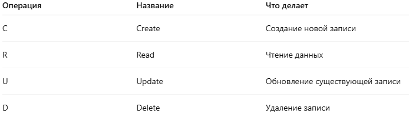

# Hibernate

Hibernate это ORM (Object relation mapping). Позволяет сопоставлять Java-классы таблицам в БД и автоматически генерировать SQL-запросы для операций CRUD. Hibernate инкапсулирует детали JDBC, устраняет шаблонный код и обеспечивает независимость от конкретной СУБД.

## Что такое CRUD операции?

**CRUD** — это аббревиатура для базовых операций с базой данных:

## Cache

Кэш нужен для меньшего кол-ва SQL-запросов к БД и для экономии ресурсов

**Кеширование состоит из двух уровней:**

- First level cash (Обязательно)
- Second level cash (Опционально)

### PersistenceContext

Это среда в которой управляются объекты-сущности в течении одного жизненного цикла EntityManager или Session. Функции:

- Хранит экземпляры сущностей (Entity)
- Следит за изменениями в этих сущностях
- Отвечает за автоматическую синхронизацию с БД

### First Level Cash

Это встроенный механизм кэширования, который работает по умолчанию и на уровне сессий. Он автоматически сохраняет объект загруженные из БД в кэш, связанный с текущей сессией. Если объект есть в `Session.PersistenceContext` то запрос в БД не пойдёт.

Для каждой сессии свой кэш и свой `PersistenceContext` 

Обновление происходит после закрытия транзакции.

## Жизненный цикл

- При создание он Transient
- При сохранение или get операции он Persistent (Для своей сессии)
- При удалении Removed

## JPA

**Java Persistence API**. Спецификация Java которая предоставляет **набор интерфейсов/аннотаций** для ORM. Hibernate это одна из самых распространённых JPA реализаций

## Embedded components

**Встроенный компонент** — это **вспомогательный класс**, который **встраивается в основную сущность** как набор её полей. Эти поля отображаются как **часть таблицы сущности**, а не как отдельная таблица. У этого объекта **нет собственного идентификатора (ID).**

- `@Embeddable` - этой аннотацией помечается встроенный компонент
- `@Embedded` - над полем встроенного компонента (не обязательная аннотация)
- `@AttributeOverride(name = “”, column = @Column(name = “”))` - над полем встроенного компонента, указывает как поле встроенного компонента называется в БД

## Primary Key

Когда мы создаём Entity нужно обязательно пометить первичный ключ аннотацией `@Id` . Есть два вида id:

- Натуральный - когда id уже существует и мы на него ссылаемся.
- Синтетический - когда мы генерируем id

При необходимости можно сгенерировать ключ с помощью `@GeneratedValue(strategy = )`

Стратегии генерации:

- `GenerationType.AUTO` - выбирается тип генерации автоматически в зависимости от используемой БД и диалекта
- `@GenerationType.TABLE` - устаревший вариант
- `@GenerationType.IDENTITY` - самый популярный вариант, когда БД ответственна за автогенерацию Id
- `@GenerationType.SEQUENCE` - использует конкретный сиквенс для генерации ключа

## Lazy and Eager

### Lazy загрузка (ленивая)

*“Загрузи только при необходимости”*

Когда загружается сущность, **связанные объекты не загружаются сразу**. Вместо них создаётся **proxy-объект**. Hibernate делает реальный SQL-запрос **только если вы обратитесь к полю.** 

- `@ManyToOne(fetch = FetchType.LAZY)`

Может привести к `LazyInitializationException`, если обратиться к полю после закрытия сессии.

---

### Eager загрузка (жадная)

*“Загрузи всё сразу”*

Hibernate загружает связанную сущность **сразу же**, вместе с основной

- `@ManyToOne(fetch = FetchType.EAGER)`

## Связи между сущностями

### `@ManyToOne`

**Многие к одному**: **много объектов одной сущности** могут быть связаны с **одним объектом другой сущности**. 

По умолчанию:

- `fetch = FetchType.EAGER` Загружается всё
- `optional = true` - Поле может быть null. Стандартно left join, можно поставить false и будет пересечение, т.е. inner join
- `cascade = {}` - Можно установить CascadType.ALL и тогда hibernate достроит каскад*

---

### `@OneToMany`

**Один ко многим**: **один объект** связан с **множеством других объектов**. Тут уже обратно от @ManyToOne 

`mappedBy = ""` говорит Hibernate: *"вот та сторона — владелец связи, у неё хранится внешний ключ"*

- `fetch = FetchType.LAZY` Загрузка при обращении
- Если не указать mappedBy, Hibernate создаст отдельную таблицу связи, но можно и не указывать

---

### `@OneToOne`

Эта аннотация указывает, что одна сущность связана **ровно с одной** другой сущностью. Можно указать аннотацию `@JoinColumn(name = “”)` чтобы указать к какой колонке идёт маппинг

---

***Cascade (каскад)** означает: *"если я что-то делаю с одной сущностью, Hibernate должен автоматически сделать то же самое с её связанными сущностями."*

## Сортировка

### Сортировка средствами SQL

`@OrderBy` - для сортировки, указываем над коллекцией

`@OrderBy(”username DESC”)`

### Сортировка на уровне приложения(в памяти)

`@OrderColumn(name = “id”)`

## Наследование

`@MappedSuperclass` - отмечаем суперкласс от которого наследуем поля. Либо можно аннотировать интерфейс и имплементировать его. Используется чаще для простых вещей чтобы вынести поля в отдельный класс

---

### Стратегии мапинга наследования

В суперклассе указываем аннотацию `@Inheritance(strategy = )` и указываем одну из трёх стратегий. По умолчанию стоит `SINGLE_TABLE`

---

`TABLE_PER_CLASS` - не часто используется. Создаёт раздельные таблички и дублирует все поля из суперкласса.

`SINGLE_TABLE` - используется чаще всего благодаря производительности. Создаёт большую табличку и помещает туда все данные. Hibernate добавит столбец-дискриминатор (type) по которому будет различать типы

`JOINED` - создаст раздельные таблички. У суперкласса будут общие поля, а у наследника дополнительные поля, плюс внешний ключ на суперкласс.

## HQL

**HQL** — это **объектно-ориентированный язык запросов**, похожий на SQL, но работает **с сущностями Hibernate**, а не напрямую с таблицами и столбцами БД.
Он позволяет выполнять запросы к данным, используя имена **классов и полей**, а не имен таблиц.