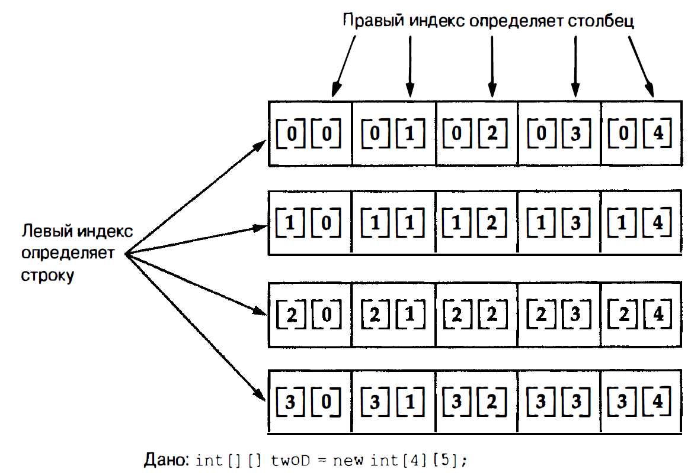

# Java

## ООП

Все компьютерные программы состоят из двух элементов: кода и данных. Существуют две парадигмы, определяющие то, как строится программа. 

- Первый способ называется **моделью, ориентированной на процессы**. Такой подход характеризует программу как **последовательность линейных шагов.**
- Для управления растущей сложностью был предложен второй подход, называемый **объектно-ориентированным программированием**. Объектно-ориентированное программирование позволяет организовать **программу вокруг ее данных (т.е. объектов) и набора четко определенных интерфейсов к таким данным**.

Важнейшим элементом ООП является абстракция. Например, люди не представляют
себе автомобиль как набор из десятков тысяч отдельных деталей.

### Принципы ООП

- **Инкапсуляция**. Это когда объект сам решает, какие свои детали он показывает наружу, а какие скрывает, **защищая их от внешнего вмешательства и неправильного использования**. Инкапсуляцию можно считать **защитной оболочкой**, которая предотвращает произвольный доступ к коду и данным из другого кода, определенного вне оболочки. **Основой** инкапсуляции в Java **является класс**. *Пример: пульт от телевизора (кнопки - открытый интерфейс, микросхемы - внутренняя логика).*
- **Наследование**. Процесс, посредством которого один **объект приобретает свойства другого объекта**. Создаётся иерархия, становится чище код, позволяет добавлять поведение, не ломая существующее. **Где ожидается родитель, можно подставить потомка.**
    - При наследовании объектов соблюдать принцип “от общего к частному”
    - Конструкторы не наследуются (каждый класс создает свои, нужные конструкторы)
    - Множественное наследование запрещено
    
    Есть два способа расширения функционала класса: наследование, композиция. Оба способа отличаются подходом.
    
- **Полиморфизм. (от греческого “много форм”).** Механизм, благодаря которому можно выделить логику в интерфейс, а классам дать реализовать по своему эту логику. Можно сказать одной фразой - **"один интерфейс, несколько реализаций”**. Полиморфизм также можно реализовать с помощью методов. **Суперклассы и подклассы реализуют иерархию с продвижением от меньшей специализации к большей**

---

Композиция - это расширение функционала класса за счёт внедрения других классов. Класс - это как конструктор, и он собирается из других частей. Например автомобиль - класс, руль,колесо, и тд. - блоки которые расширяют функционал класса.

### Наследование - расширение, композиция - внедрение

**Композиция - “has-a” (содержит, имеет), наследование “is-a” (является).** Так можно проверять объекты. Минус наследование - код родительского класса влияет на все дочерние классы, поэтому иногда правильнее использовать композицию.

## Типы данных

**Java - строго типизированный язык.** Каждая переменная имеет **свой тип**, у каждого **выражения есть тип**, каждое **присваивание проверяется на совместимость типов**. **Компилятор java проверяет все типы на совместимость!**

### **Примитивные типы**.

В java их восемь: **byte, short, int, long, char, float, double, boolean.** Можно использовать типы в том виде, как есть, либо создавать массивы или собственные типы классов. Таким образом, они образуют **основу для всех других типов данных, которые вы можете создать.** 

- **Примитивные типы данных не объекто-ориентированные, т.к. это снизило бы эффективность, и обеспечивает переносимость.**
- Примитивы имеют свой **строгий размер**, диапозон, и обладают **математическим строгим поведением.**
    
    
    | --- | --- |
    

### Литералы

В Java **литерал** (literal) — это прямое **представление фиксированного значения** в исходном коде программы. Это константные значения, которые не вычисляются, а записываются непосредственно в коде.

Указывать целочисленные литералы можно также в двоичной форме, добавляя к значению префикс 0b или 0B. `int a = 0b10101` . Булевские литералы только `true` и `false`, 0 и 1 нельзя вставить

Когда **значение одного типа присваивается переменной другого типа**, автоматическое преобразование типов происходит в случае удовлетворения следующих двух условий:

- **Два типа совместимы;**
- **Целевой тип больше исходного типа.**

**null** - это специальное литеральное значение которое работает **с ссылочными типами данных, и не указывает ни на какой объект**

### Приведение

**Преобразование между двумя несовместимыми типами создается с использованием приведения**. Приведение представляет собой просто явное преобразование типа и имеет следующую общую форму: `(целевой тип) значение` . 

Если целочисленное значение выходит за пределы диапазона типа byte, тогда оно **уменьшается по модулю** (остатку от целочисленного деления) диапазона byte. 

Когда переменной целочисленного типа присваивается значение с плавающей точкой, будет происходить другой тип преобразования: усечение.

## Массивы

**Массив** - это группа переменных одного типа данных к которому можно обращаться по имени. Доступ осуществляется по индексу.

### Одномерный массив

Одномерный массив по существу представляет собой **список переменных одного типа. Получение массива - двухэтапный процесс**. Во-первых, вы обязаны объявить переменную нужного типа массива. Во-вторых, вы должны выделить память, в которой будет храниться массив, с применением операции new и назначить ее переменной типа массива.

**`int[] array = new int[размер]`** 

**`int array[] = {1, 2, 3};`**

Получать доступ можно по индексу: **`array[1] = 2;`** 

---

### Многомерный массив

Многомерный массив - это массив массивов. Объявляется доп скобками:

**`int[][] multiArray = new int[размер][размер]`**



При размещении многомерного массива необходимо **указывать память только для первого (самого левого) измерения**. Остальные измерения можно размещать по отдельности. 

```java
int[][] multiArray = new int[2][];
multiArray[0] = new int[3];
multiArray[1] = new int[10];
```

## Операции

**Арифметические операции**

| **Оператор** | **Описание** | **Пример** | **Результат** |
| --- | --- | --- | --- |
| `+` | Сложение | `5 + 3` | `8` |
| `-` | Вычитание | `5 - 3` | `2` |
| `*` | Умножение | `5 * 3` | `15` |
| `/` | Деление | `10 / 3` | `3` (целочисленное) |
| `%` | Остаток от деления | `10 % 3` | `1` |
| `++` | Инкремент | `a++` | `a = a + 1` |
| `--` | Декремент | `a--` | `a = a - 1` |

У операции инкремента и декремента есть разница в *постфиксной и префиксной формой*. **В префиксной форме операнд инкрементируется или декрементируется перед получением значения для использования в выражении. В постфиксной форме предыдущее значение извлекается для применения в выражении, после чего модифицируется операнд.**

В префиксной форме `x = 42;`

                                    `y = ++x;` Тогда `y = 43;` 

В постфиксной форме `y = x++;` Будет `y = 42;`

Т.к. в первом случае: проходят две операции `x = x + 1; y = x;` 

                                                        А во втором: `y = x; x = x + 1;`

---

**Побитовые операции**

| **Оператор** | **Описание** | **Пример** | **Результат (бинарно)** |
| --- | --- | --- | --- |
| `&` | Побитовое И | `5 & 3` | `101 & 011 = 001` (1) |
| `|` | Побитовое ИЛИ | `5 | 3` | `101 | 011 = 111` (7) |
| `^` | Побитовое XOR | `5 ^ 3` | `101 ^ 011 = 110` (6) |
| `~` | Побитовое НЕ | `~5` | `~00000101 = 11111010` |
| `<<` | Сдвиг влево | `5 << 1` | `101 << 1 = 1010` (10) |
| `>>` | Сдвиг вправо | `5 >> 1` | `101 >> 1 = 10` (2) |
| `>>>` | Беззнаковый сдвиг вправо | `-5 >>> 1` | Сохраняет знак |

В Java используется кодировка, известная как **дополнение до двух или дополнительный код, которая предусматривает представление отрицательных чисел путем инвертирования** (замены единиц на нули и наоборот) **всех битов в значении и последующего добавления единицы к результату.**

И **ноль это положительное число, поэтому диапазон нижней границы выше чем верхней**

---

**Операции отношения**

| **Оператор** | **Описание** | **Пример** | **Результат** |
| --- | --- | --- | --- |
| `==` | Равно | `5 == 3` | `false` |
| `!=` | Не равно | `5 != 3` | `true` |
| `>` | Больше | `5 > 3` | `true` |
| `<` | Меньше | `5 < 3` | `false` |
| `>=` | Больше или равно | `5 >= 5` | `true` |
| `<=` | Меньше или равно | `5 <= 3` | `false` |
| `instanceof` | Проверка типа | `"str" instanceof String` | `true` |

**Логические операции**

| **Оператор** | **Описание** | **Пример** | **Результат** |
| --- | --- | --- | --- |
| `&&` | Логическое И | `true && false` | `false` |
| `||` | Логическое ИЛИ | `true || false` | `true` |
| `!` | Логическое НЕ | `!true` | `false` |
| `&` | И (без short-circuit) | `true & false` | `false` |
| `|` | ИЛИ (без short-circuit) | `true | false` | `true` |
| `^` | Исключающее ИЛИ | `true ^ false` | `true` |

В случае применения форм | | и && вместо форм I и & указанных операций Java **правый
операнд не будет вычисляться в ситуации, когда результат выражения может быть определен только левым операндом.**

---

### Тернарный оператор

**`условие ? значение1 : значение2`** Здесь условие **любое boolean выражение**. Если выражение **`true` тогда выполняется значение1, в ином случае значение2.**

## Управляющие операции

### Операторы выбора

В Java поддерживаются **два оператора выбора: if и switch**. Они предоставляют возможность управления потоком выполнения программы на основе условий, известных только во время выполнения.

**`if (условие) оператор; else оператор`**

```java
if (условие) оператор; 
else if (условие) оператор;
else оператор
```

Операторы if выполняются сверху вниз. Как только одно из условий, управляющих if, становится истинным, выполняется оператор, связанный с этим if, и остальная часть цепочки игнорируется.

---

Оператор switch в Java обеспечивает **переход по множеству путей**. Он предлагает простой способ направления потока выполнения на разные части кода в зависимости от значения выражения.

```java
switch(выражение) {
	case значение1: 
		// операции
		break;
	case значение2:
		// операции
	default:
		// в случае если ничего не подошло
```

В выражении можно использовать byte, short, int, long, char, перечисления, String. `break` применяется для остановки последовательности операторов.

- Оператор switch отличается от if тем, что он может проверять только на предмет равенства, тогда как оператор if способен оценивать логическое выражение любого вида. То есть switch ищет только совпадение значения выражения с одной из констант в операторах case.
- **Никакие две константы case в одном switch не могут и меть одинаковые значения.** Разумеется, один оператор switch и включающий его внешний switch могут иметь общие константы case.
- Оператор switch обычно **более эффективен, чем набор вложенных операторов if.**

---

### Оператор итераций/циклы

**Цикл while** - самый фундаментальный оператор итерации в Java. Он **повторяет выполнение оператора** или блока до тех пор, **пока истинно управляющее выражение**. Если тело изначально ложно, то цикл не выполнится.

**`while (условие) { // тело цикла }`**

---

**do while - цикл который выполнит тело хотя бы один раз.** Цикл do-while особенно полезен при обработке выбора пункта меню, потому что обычно требуется, чтобы тело цикла меню выполнялось хотя бы один раз.

---

**Цикл for - цикл в котором можно указать условие, итерацию, и инициализацию.** Чтобы использовать больше одной переменной цикла, можно разделить их запятой. Можно не указывать инициализацию, и итерацию, или вообще ничего не указывать и будет бесконечный цикл.

**`for (инициализация-переменной-цикла; условие; итерацию) {  // тело цикла }`**

---

**Цикл for-each - проходит по коллекции, массивам по каждому элементу**. Его **переменная итерации доступна только для чтения**, хотя она связана с лежащим в основе массивом. **Присваивание значения переменной итерации не влияет на лежащий в основе массив.** Другими словами, изменить содержимое массива, присваивая переменной итерации новое значение, не удастся.

**`for (тип переменная-итерации : коллекция) { // тело цикла }`**

---

**Для выхода из цикла** можно использовать `break` . Также можно использовать goto, то есть повесить метку на цикл, и сделать `break метка` из вложенного цикла и сразу и родительского. 

Иногда необходимо обеспечить, чтобы итерация цикла выполнилась раньше, до достижения конца тела. Можно сказать переход в конец цикла. За это отвечает слово **`continue`**

## Классы

**Класс определяет структуру и поведение (данные и код), которые будут общими для набора объектов:** Каждый объект заданного класса содержит структуру и поведение, определенные классом, как если бы он был "отлит" в форме класса.

- **Класс определяет новый тип данных.**
- **Класс - это шаблон для объекта, а экземпляр класса - это сам объект**
- **Данные или переменные класса называются - переменные экземпляра (**каждый экземпляр класса содержит собственную копию этих переменных)
- **Как правило методы определяют его поведение**
- Метод main является входной точкой в программу
- Если класс `public` тогда он должен быть единственным открытым классом в файле. И файл должен иметь такое же имя как класс.


Операция new создаёт объект класса, выделяя память под этот экземпляр.

`class имя { тело класса }` 

---

### Модификаторы, и ключ. слова

- **Класс может быть `public`, или `default`.**
- Может быть **`final`**, и тогда **запрещено наследование этого класса**
- **`static`** - **нельзя** помечать top-level класс
- **`super`** - позволяет **обращаться к полям, конструкторам, переменным суперкласса**

Иногда метод или конструктор может обращаться к переменным класса с помощью ключевого слова **`this.имя-переменной`**

Поле класса можно объявить **`final`** и тогда поле становится константной, и его **дальнейшее изменение запрещено. Можно присвоить значение при объявлении и в конструкторе!**

---

### Вложенные классы

Внутри класса можно определять ещё один класс. ****Этот **вложенный класс не существует независимо от основного класса.** **Имеет доступ к полям, однако основной класс не имеет доступ к его полям.**

Можно применять **все модификаторы**, также как в top-level классе. Также можно пометить **`static`**, и тогда вложенный класс будет **не зависеть от объемлющего класса**.

---

### Наследование

**С помощью наследования можно указать один общий класс с общими полями, затем этот класс может быть унаследованным, и перенять логику и поведение родителя.** Унаследованный класс является - *суперклассом*, а выполняющий наследование - *подкласс*.

- Класс может **унаследовать только один суперкласс**.
- **Каждый потомок может встать на место родителя.**
- **Суперклассу ничего не известно о каких либо подклассах.**

Наследование указывается `extends супер-класс`

Всё, что суперкласс должен сделать для корректного состояния своих полей, **должно быть завершено до того, как подкласс начнёт свои действия**. Иначе поля суперкласса могут быть в неконсистентном состоянии, а методы подкласса могут использовать эти поля.

---

### Абстрактные классы

**Абстрактный класс** - это класс **объект которого нельзя создать**, который может в себе иметь **методы которые не имеют реализации, а также обычные методы.** 

- Любой класс, содержащий один или несколько абстрактных методов, тоже должен быть объявлен абстрактным.
- Не может содержать абстрактных конструкторов или абстрактные статические методы
- Любой класс наследуемый от абстрактного должен реализовать все методы, или самому быть объявленным абстрактным.

## Методы

**Метод - это функция в которой выполняется код, и происходит работа с данными.** Принадлежат классу или объекту класса, можно многократно вызывать.

**Сигнатура метода - это “шапочка” метода, по которой этот метод определяет вызывающий код.** В сигнатуру входят модификаторы, возвращаемый тип, имя метода, список параметров, конструкция `throws`

```java
**[модификаторы] возвращаемый-тип имя([список-параметров]) throws { 
	// тело метода 
	return значение; // если не void
}**
```

Модификаторы:

- **`static`** - делает **метод независимым от экземпляра класса** (могут вызывать только другие статические методы своего класса, и только работать со статическими переменными, не могут ссылаться на `this`, и `super`)
- **`final`** - **запрещает переопределять метод в потомках**.

В классе разрешено иметь несколько методов **с одинаковым именем, но с разной сигнатурой, это называется перегрузка метода.** 

---

### Переопределение методов

Если у суперкласса есть метод который **не `final`, его можно переопределить в подклассе, указывая одинаковую сигнатуру**, или добавлением аннотации `@Override` . Переопределенные методы - еще один **способ, которым в Java обеспечивается аспект полиморфизма "один интерфейс, несколько методов”** 

**Method chaining** - это когда метод возвращает объект нашего типа, и у этого же объекта мы можем вызвать ещё метод. **`stringBuilder.append(”1”).append(”2”)`**

## Интерфейсы

**Интерфейс - это полностью абстрактный шаблон который класс должен реализовать.**

Определяется: **`[модификаторы] interface имя { // методы }`**

- В интерфейсах можно объявлять переменные. Они неявно являются `final` и `static`, т.е. не могут изменяться реализующим классом. Они также **должны быть инициализированы**.
- Неявно все **методы интерфейса являются `public abstract`**
- После определения интерфейс может быть реализован **любым количеством классов**.
- Кроме того, один класс может реализовывать **любое количество интерфейсов**.
- Доступно **множественное наследование интерфейсов** через extends

---

### Стандартные & статические & закрытые методы

После java 8 появился механизм где есть методы которые уже имеют свою стандартную реализацию, но которую можно переопределить. 

**`default возвращаемый-тип имя-метода() { // стандартная реализация }`**

И также можно создавать методы не зависимые от конкретной реализации. 

**`static возвращаемый-тип имя-метода() { // тело метода }`**

После java 9 можно добавлять закрытые методы, как `static`, так и обычные

**`private [static] возвращаемый-тип имя-метода() { // тело метода }`**

---

### Отличия абстрактного класса от интерфейса

В абстрактном классе можно создавать конструкторы, любые методы, любые поля. В интерфейсе все переменные - константы, методы с реализацией после Java 8.

---

## Исключения Exception

**Исключения - это объект который описывает ошибочное состояние которое произошло внутри кода.** 

- Метод может обработать исключение, или передать его дальше.
- Исключения могут выбрасываться средой или самим разработчиком.
- Если исключения не обрабатывать, тогда программа остановится

Код который нужно проверить на наличие исключений заключается в конструкцию `try {}` а ожидаемое исключение помещается в `catch (тип-исключения объект исключения) {}` 

Оператор `try` может быть вложенным, **если не найдется обработка ошибки, то она пойдет выше по стеку пока не найдется обработчик.**

Операторы обработки исключений Java **не следует рассматривать как общий механизм нелокального ветвления**, потому что это только запутает код и затруднит его сопровождение.

---

### Типы исключений

Все исключения являются потомками Throwable и дальше делятся на Exception и Error


- **Exception - это тип исключений который является суперклассом всех ошибок программы которые можно обрабатывать.** Также у него есть исключение RuntimeException наследуя который можно создавать собственные исключения
- **Error - это ошибки исполняющей среды, критические ошибки.** Обычно их не обрабатывают, потому что восстановиться после них почти нельзя

---

### Throws

Если метод может выбрасывать исключение, то можно предупредить вызывающий код конструкцией `throws исключение` в сигнатуре метода. Она не обязательно, но желательно, для большей читабельности

---

### Finally

`finally` - это конструкция которая **выполняется в любом случае**, даже если была вызвана ошибка, или не было, был `return` или нет. Помечается после блока `catch`, или после `try` если нету `catch`

### try-with-resources

Это специальная форма блока **`try`** в Java, которая **автоматически закрывает ресурсы** (такие как файлы, сетевые соединения, потоки ввода-вывода и т. д.) после завершения работы с ними, даже если произошло исключение.


Оператор try с ресурсами можно применять только с теми ресурсами, которые реализуют интерфейс `AutoCloseable`. Можно также использовать конструкции `catch` и `finally`

Ресурс, объявленный в операторе `try`, неявно является final. Кроме того, область действия ресурса ограничена оператором try с ресурсами. Чтобы использовать более одного ресурса в одиночном try, необходимо отделить ресурсы точкой с запятой ;

## Многопоточное программирование

Многопоточная **программа состоит из двух или более частей, которые могут выполняться одновременно**. Каждая такая часть называется потоком и определяет отдельный путь выполнения. Многопоточность — это специализированная форма многозадачности.

- Можно реализовать интерфейс `Runnable`
- Можно расширить класс `Thread`

В обоих случаях необходимо переопределить метод `run()`


**Состояния потоков:**

- Поток может выполняться
- Может быть готов к запуску
- Может быть приостановлен
- Может быть возобновлен
- Может быть заблокирован при ожидании
- Может быть завершен

---

**Приоритеты потоков**

Приоритет потока — это целое число, определяющее относительный приоритет одного потока над другим.

- Поток может добровольно передать управление
- Поток может быть вытеснен потоком с более высоким приоритетом

---

**Синхронизация**

Для предотвращения конфликтов используется *монитор* — механизм, позволяющий выполняться только одному потоку. Применяется ключевое слово `*synchronized*`. Для синхронизации объекта класса используется конструкция `synchronized(объект) {операторы, подлежащие синхронизации}`

---

**Опрос** — это процесс, при котором поток в цикле постоянно проверяет изменение состояния. Создает бесполезную нагрузку на процессор. Вместо этого следует использовать `wait()` и `notify()`, `notifyAll()`.

---

**Атомарная операция** — это такая операция, которая выполняется **целиком и сразу**, **без возможности быть прервана или разделена** другими потоками. Во время её выполнения **никакой другой поток не может вмешаться** и изменить состояние, связанное с этой операцией. Для атомарности можно использовать Atomic классы или synchronized

---

Ключевое слово **`volatile`** говорит **JVM и процессору**, что **переменную нельзя кэшировать в локальной памяти потока** (stack). Вместо этого **каждый доступ (чтение или запись) к этой переменной должен происходить напрямую из общей (heap) памяти**. **Но не гарантирует атомарности операций.**

---

`instanceof` - это инструмент с помощью которого программа **может получать информацию о типе объекта** во время выполнения. 


Здесь `objref` представляет собой ссылку на экземпляр класса, а `type` - тип класса. Если аргумент `objref` относится к указанному типу или может быть к нему приведен, то результатом вычисления является `true`. В противном случае результатом будет `false`.

## Перечисления Enum

Перечисление - представляет собой **список именованных констант**, который определяет **новый тип данных и его допустимые значения.**

- **Перечисление - это особый вид класса,** созданный компилятором автоматически, когда пишется `enum`
- Перечисление может иметь конструкторы, методы, переменные экземпляра и реализовывать интерфейсы.
- **При определении конструктора**, для перечисления **он будет вызываться при создании каждой константы перечисления**. Т.е. у каждой константы должен вызываться этот конструктор

---

- Перечисление **не может быть унаследовано** от другого класса
- Перечисление **нельзя расширять**, т.е не может служить суперклассом
- **Каждая константа** перечисления **является объектом своего типа перечисления**

---


Идентификаторы `Jonathan`, `GoldenDel` и т.д. называются **константами перечислениями**. Каждая из них неявно объявляется как **открытый статический финальный член Apple.**

---

- Экземпляр перечисления не создаётся с помощью *new*. **Потому что это особый вид класса, у которого заранее определено конечное число экземпляров**
- Метод `values()` возвращает массив, содержащий список констант перечисления
- Метод `valueOf()` возвращает константу перечисления, значение которой соответствует строке в аргументе.

---

| **Метод** | **Предназначение** |
| --- | --- |
| `final int ordinal()` | Возвращает порядковые номер константы, на которой вызывается |
| `final int compareTo(enum-type e)` | Сравнивает порядковые номера одного и того же перечисления.  |
| `equals()` | Объекты будут равны только если оба ссылаются на одну и ту же константу того же перечисления |

---

## Обобщения Generics<>

**Обобщения** — это механизм в Java, который позволяет создавать **классы, интерфейсы и методы**, работающие **с различными типами данных**, **без потери типобезопасности**. Чтобы не создавать 100 одинаковых классов для работы с разными типами, или не рисковать с приведением из `Object`.

- Работают **только с ссылочными типами** данных
- Обобщенные типы **различаются на основе их аргументов типов**
- Указывать параметры **не обязательно**, тогда работа будет с классом `Object`
- Работают **на этапе компиляции** а **не в рантайме**
- **Нельзя** создать массив типа параметра
- ***Вывод типов по аргументам***, а не по переменным
- В обобщенной иерархии **любые аргументы типов, необходимые обобщенному суперклассу, должны передаваться вверх по иерархии** всеми подклассами.
- Привести один экземпляр обобщенного класса к другому можно только в том случае, **если во всем остальном они совместимы и их аргументы типов совпадают.**
- Обобщенный класс **не может наследовать тип Throwable**

---


**Обобщенный класс Gen**. T - это имя параметра типа. Можно написать любые доступные символы (var написать нельзя). Рекомендуется применять имена в виде **односимвольных заглавных букв**. Таким образом, Т используется внутри Gen всякий раз, когда требуется параметр типа.


---

### Стирание типов

**Стирание типов (type erasure)** — это механизм, при котором **обобщённая информация о типах удаляется компилятором** во время компиляции, чтобы обеспечить совместимость с предыдущими версиями Java.
Типы проверяются на этапе **компиляции**, но **не сохраняются в байт-коде**, и в рантайме вы не знаете, с какими типами вы работали.

---

В обобщенном типе разрешено объявлять больше, чем один параметр типа. Чтобы указать два или более параметров типов, просто применяйте список, разделенный запятыми.


---

### Ограниченные типы

**Ограниченные типы** - это механизм, который позволяет **ограничить допустимые типы параметров обобщений.** Когда указывается параметр типа можно создать верхнюю границу в виде суперкласса, от которого должны быть порождены все аргументы типов. 


Таким образом, тип `T` может быть заменен только суперклассом указанным в superclass или его подклассами. *(При компиляции наш параметр меняется на суперкласс)*

- С помощью `extends` указывается *потолок*


Для определения границы кроме типа класса **можно также применять тип интерфейса**. В качестве границ **разрешено указывать несколько интерфейсов**. Граница **может включать как тип класса, так и один или несколько интерфейсов**. В таком случае тип класса должен быть указан первым. **Когда граница содержит тип интерфейса, то допускаются только аргументы типов, реализующие этот интерфейс.**  

---

### Подстановочный знак, WildCard

**Wildcard** - специальный символ `?`, который используется для указания **неизвестного типа.** Подстановочный знак не влияет на то, какой тип объектов можно создавать - это регулируется конструкцией `extends` . Подстановочный знак просто соответствует любому допустимому объекту класса.


Также можно ограничивать аргументы с подстановочным знаком. Применяется конструкция `extends` как *потолок*, или `super` как *пол.*

---

### Обобщенные методы

Можно создавать **обобщенные методы** с одним, или несколькими параметрами типов. Также **можно создавать обобщенный метод внутри необобщенного класса.**


Параметры типа объявляются **перед возвращаемым типом** метода. Также можно использовать ограничения. 


Если мы используем дженерик, но не получаем его в аргументе то мы получаем ошибку `cannot be instatiated directly`

---

### Обобщенные конструкторы

Конструкторы могут быть обобщенными, даже когда их класс таковым не является.


---

### Обобщенные интерфейсы

Могут существовать обобщенные интерфейсы, которые определяются аналогично обобщенным классам. Общий синтаксис:


При реализации обобщенного интерфейса классом class-name в type-arg-list необходимо указывать аргументы типов. Также если у интерфейса есть какие-то границы, то необходимо их повторить в классе который реализует интерфейс


## Оболочки типов, автоупаковка/автораспаковка

**Оболочки типов** - представляют собой классы, инкапсулирующие примитивный тип внутри объекта. Можно работать с generics, и может быть null.

- Процесс инкапсуляции значения внутри объекта называется упаковкой.
    
    `Integer iOb = Integer.valueOf(100);`
    
- Процесс извлечения значения из оболочки типа называется распаковкой.
    
    `int i = [iOb.int](http://iOb.int)Value();`
    

**Автоупаковка** - это процесс, с помощью которого примитивный тип автоматически инкапсулируется (упаковывается) в эквивалентную ему оболочку типа всякий раз, когда требуется объект такого типа. Нет необходимости явно создавать объект.

`Integer iOb = 100;`

**Автораспаковка** - это процесс, при котором значение упакованного объекта автоматически извлекается (распаковывается) из оболочки типа , когда значение необходимо.

`int i = iOb;`

Благодаря автоупаковке устраняется потребность в ручном создании объекта с целью помещения в него значения примитивного типа. Обо всем позаботится компилятор Java.

## Аннотации @Annotation

**Аннотации** - это средство, позволяющее **встраивать дополнительную информацию** в файл исходного кода, оставляя семантику программы неизменной. Аннотацию может обрабатывать генератор исходного кода (Lombok, Hibernate и т.д).

- Все аннотации состоят **исключительно из объявлений методов**
- Аннотация **не может наследовать классы**
- Все аннотации расширяют интерфейс Annotation который является суперинтерфейсом.
- Аннотировать можно всё, классы, методы, поля, параметры, константы и т.д.
- **Все методы объявленные аннотацией не должны принимать параметры. И они обязаны возвращать один из типов**: примитивный тип, String или Class, объект типа enum, объект типа другой аннотации, массив одного из допустимых типов
- **Мета-аннотации** - аннотации применимые при создании своей аннотации


---

Политика хранения аннотаций определяет, **на каком этапе жизненного цикла программы** аннотации сохраняются и доступны. В Java определены три такие политики, которые
инкапсулированы внутри перечисления:

- `SOURCE`  удерживается только в файле исходноrо кода и на этапе компиляции отбрасывается. (Используется например для генерации кода и т.д.)
- `CLASS` на этапе компиляции сохраняется в файле . class. Однако она **не будет доступной через машину JVM** во время выполнения.
- `RUNTIME` на этапе компиляции сохраняется в файле . class и **доступна через машину JVM** во время выполнения. Таким образом, политика RUNTIME обеспечивает наивысшее постоянство аннотаций.

Политика хранения указывается с помощью `@Retention(retention-policy)` можно указать любую из констант выше.

---

Получение аннотаций во время выполнения с использованием рефлексии. Только для аннотаций RUNTIME. 

| **Метод** | **Значение** |
| --- | --- |
| getClass() | Получаем объект Class |
| getMethod(String methName, Class<?> … paramTypes) | Вызываем метод по его имени. Если в методе есть аргументы то нужно их внести а то будет ошибка NoSuchMethodException |
| getField(String fieldName) | Получаем поле по имени |
| getAnnotation(Class<A> annoType) | Получаем значения этой аннотации. Под annoType помещается интересующая нас аннотация |
| Annotation[] getAnnotations() | Используется в программе для получения массива всех аннотаций |
| boolean isAnnotationPresent(Class<A> annoType) | Возвращает true если у нас есть аннотация ассоциирована с вызывающим объектом |

---

**Для членов аннотации можно задавать стандартные значения**, которые будут использоваться, если при применении аннотации не указано значение.

`type name() default value;`

---

- **Маркерные аннотации** - вид аннотации, **не содержащий членов.** Цель - пометить элемент. Скобки не обязательно указывать
- **Одноэлементные аннотации** - содержит только один член. Позволяет использовать сокращённую форму для указания значения члена - не указывать имя а сразу значение. Однако для использования такого сокращения именем члена должно быть value.

---

**Встроенные аннотации java**

| **Аннотация** | **Значение** |
| --- | --- |
| `@Retention` | Мета-аннотация которая **определяет политику хранения** |
| `@Documented` | Мета-аннотация которая **добавляет документацию** классов и методов |
| `@Target` | Мета-аннотация которая **задаёт типы элементов к которым может применяться аннотация**. Принимает аргумент представляющий собой массив констант перечисления `ElementType`. Если `@Target` отсутствует тогда аннотацию можно использовать где угодно |
| `@Inherited` | Мета-аннотация. Если аннотация с `@Inherited` применяется к **классу**, то **подклассы этого класса также будут "наследовать" эту аннотацию**, когда ты получаешь её через `getAnnotation(...)`. |
| `@Override` | Маркерная аннотация которую можно использовать только для методов. Метод с этой аннотацией **должен переопределять метод из суперкласса**, иначе возникнет ошибка на этапе компиляции |
| `@Deprecated` | Указывает, что **объявление устарело и не рекомендуется к употреблению**. Можно использовать ко всему |
| `@FunctionalInterface` | Маркерная аннотация, **указывает на то что аннотированный интерфейс является функциональным.** Если не аннотированный интерфейс таковым не является, тогда будет ошибка при компиляции |
| `@SafeVarargs` | Маркерная аннотация, **указывает на отсутствие небезопасных действий** связанных с аргументом переменной длины. Она должна
применяться только к методам или конструкторам с аргументами переменной длины. Методы также обязаны быть static, final или private. |
| `@SuppressWarnings` | Указывает, что **одно или несколько предупреждений, которые могут быть выданы компилятором, должны быть подавлены.** |

---

**Первоначально аннотации были разрешены только в объявлениях.** Тем не менее, современные версии Java позволяют **указывать аннотации в большинстве случаев использования типов**.


Аннотации типов важны, поскольку они позволяют инструментам выполнять дополнительные проверки кода , чтобы предотвратить ошибки. Аннотация типа должна включать `ElementType.ТУРЕ_USE` в качестве цели.

---

**Повторяющиеся аннотации** — это возможность **применять одну и ту же аннотацию к одному элементу** **несколько раз**.

Чтобы аннотацию можно было повторять, ее потребуется снабдить аннотацией `@Repeatable` и в поле указать контейнер. Контейнер это аннотация для которой поле value представляет собой массив повторяющихся аннотаций.


## Ввод/Вывод

**Поток данных** - это абстракция, реализации которые либо производит, либо потребляет информацию. Потоки используются для **чтения и записи данных** и представляют собой **последовательность байтов или символов**, которую можно читать или записывать по очереди.


Java Input/Output иерархия:

- **InputStream, OutputStream** - байтовые потоки данных
- **Reader, Writer** - символьные потоки. Они обрабатывают потоки символов Unicode

Есть много реализаций этих абстрактных классов которые выполняют нативный C/C++ код

---

### Ввод

Консольный ввод в Java выполняется (прямо или косвенно) путем чтения из `System.in`. Один из способов получения символьного потока, присоединенного к консоли, предусматривает помещение `System.in` в оболочку `BufferedReader`.


**Буферизация** - это процесс, при котором **данные накапливаются в буфере** перед тем как быть прочитанными или записанными.

---

### Вывод

Консольный вывод проще всего обеспечить с помощью описанных ранее методов `print()` и `println()`, эти методы определены в классе PrintStream (тип объекта, на который ссылается System.out). `public static final PrintStream *out* = null;`

Но лучше использовать PrintWriter. Можно записывать куда угодно, консоль, файл, сеть и т.д. Можно буферизовать.

---

### Чтение файлов и запись в файлы

Двумя наиболее часто используемыми классами потоков являются `FileInputStream` и `FileOutputStream`, которые создают потоки байтовых данных, связанные с файлами.


Завершив работу с файлом, вы должны его закрыть методом `close()`, который реализован как в `FileInputStream`, так и в `FileOutputStream` или можно использовать try-with-resources. Может произойти утечка ресурсов, не записаться файл и т.д.

Для чтения из файла можно использовать версию `read()`, определенную в `FilelnputStream`. Каждый раз, когда метод `read()` вызывается, он читает один байт из файла и возвращает его в виде целочисленного значения, можно преобразовать в char.


Для выполнения записи в файл можно применять метод `write()` , определенный в `FileOutputStream`. Метод `write()` записывает в файл байт, указанный в аргументе `byteval`.
Хотя аргумент byteval объявлен как int, записываются только младшие восемь битов.


## Сериализация

`transient` - модификатор который используется для обозначения переменных экзепляра которые не нужно сериализовывать.

## Тесты

`assert` используется для проведения **проверок во время выполнения (runtime)**, обычно с целью отладки и тестирования. Он позволяет убедиться, что определенные условия выполняются, и если нет — выбрасывается исключение типа `AssertionError`.


Здесь `condition` - это выражение условия, результатом вычисления которого должно быть булевское значение. Если результат равен `true`, то утверждение истинно и никаких других действий не происходит. Если условие ложно, тогда утверждение терпит неудачу и генерируется стандартный объект `AssertionError`.


В данной версии выражение `expr` представляет собой значение, которое передается конструктору `AssertionError`. Это значение преобразуется в строковый формат и отображается в случае отказа утверждения.

По умолчанию проверки `assert` отключены в JVM. Чтобы их включить, используйте флаг `-ea` (или `-enableassertions`) при запуске:


---

## Импортирование

Статическое импортирование - это механизм, который позволяет использовать **статические члены (переменные и методы) класса без указания имени класса**.


Есть две основные формы: помещает в область видимости одиночное имя, и вторая форма импортирует все статические члены объекта

Полезно при работе с частым использованием статических методов, членов и т.д., и для использования констант (например enum)

## Какие-то доп. материалы

### Comparable

Интерфейс `Comparable` — это **стандартный интерфейс в Java**, который используется для **сравнения объектов одного типа**. Состоит из одного метода. Многие стандартные классы реализуют его для сравнения, обёртки, String, LocalDate и тд.
`public interface Comparable<T> { public int compareTo(T o);}`

### Var

`var` позволяет **объявлять локальные переменные без явного указания типа**. Компилятор сам определяет тип на основе инициализатора. `var` будет работать **только с проинициализированной переменной**. Переменную можно назвать `var`, и тогда это слово присвоится этой переменной.

Также помните о том, что ключевое слово `var` можно применять **только для объявления локальных переменных.** Его нельзя использовать, например, при объявлении переменных экземпляра, параметров или возвращаемых типов.

### Аргументы длины

**Аргументы переменной длины** - это механизм передачи **неограниченного количества переменных одного типа** данных в методе, без необходимости создавать массив.

**Определяется тремя точками:** `void method(int . . . v)` 

Наряду с параметром переменной длины метод может иметь и "обычные" параметры. Тем не менее, параметр переменной длины должен **объявляться в методе последним**. **Должен быть только один параметр длины!**

Обращаться к аргументу можно через массив. Методы также можно перегружать

## Модификаторы доступа

**Доступы к членам класса**

| **Модификатор** | **Тот же класс** | **Подкласс в этом же пакете** | **Не подкласс в этом же пакете** | **Подкласс из другого пакета** | **Не подкласс из другого пакета** |
| --- | --- | --- | --- | --- | --- |
| **public**  | Да | Да | Да | Да | Да |
| **default** | Да | Да | Да | Нет | Нет |
| **protected** | Да  | Да | Да | Да | Нет |
| **private** | Да | Нет | Нет | Нет | Нет |

Если вы хотите, чтобы элемент **был видимым за пределами вашего текущего пакета, но только классам, которые напрямую являются подклассами вашего класса**, тогда объявите этот элемент как **`protected`**.

Класс, не являющийся вложенным, имеет только два возможных уровня доступа: **стандартный и открытый**.

## Пакеты

**Пакеты - это механизм видимости**, нужны для **распределения классов с одинаковыми именами по разным пакетам.** Иначе имена было бы невозможно читать, и они когда-нибудь закончились. 

Создание пакета происходит с помощью слова `package пакет.путь;` в начале программы. 

Любые классы, объявленные в данном файле, будут при надлежать указанному пакету. Оператор `package` определяет пространство имен, в котором хранятся классы.

## Object

Класс `Object` неявно является суперклассом для всех классов. В него входит 11 методов которые можно переопределить.

- **`public final Class<?> getClass()`** Возвращает объект `Class`, который описывает **класс объекта**.
- **`public int hashCode()`** Возвращает **хэш-код объекта**, используемый в хэш-таблицах (Контракт: если два объекта равны по `equals()`, их `hashCode()` должен быть одинаковым, но обратное не обязательно)
- **`public boolean equals(Object obj)`** Сравнивает объекты на **логическое равенство**. 
По умолчанию сравнивает ссылки (`==`). Обычно переопределяется в пользовательских классах.
- **`protected Object clone() throws CloneNotSupportedException`** Создаёт **поверхностную копию объекта**. Класс должен реализовать `Cloneable`, иначе выбросится исключение.
- **`public String toString()`** Возвращает строковое представление объекта. По умолчанию: `ИмяКласса@ХэшКод`. Обычно переопределяется для удобного отображения.
- **`public final void notify()`** Разблокирует один поток, который **ждёт на этом объекте** (в синхронизированном блоке).
- **`public final void notifyAll()`** Разблокирует **все потоки**, которые ждут на этом объекте.
- **`public final void wait() throws InterruptedException`** Приостанавливает текущий поток **пока другой поток не вызовет notify/notifyAll**.
- **`protected void finalize() throws Throwable`** Вызывается **перед сборкой мусора** объекта.
- **`public final boolean equals(Object obj)`**
- **`public final void wait(long timeout, int nanos)`**

## Collections Framework

Collections framework - это библиотека которая предоставляет удобные структуры данных для записи, хранения, упорядочивания объектов которые решают различные проблемы работы с обычными массивами 

Интерфейс Collection - это основа, на которой построена инфраструктура Collections Framework, т.к. он должен быть реализован любым классом, определяющим коллекцию. Collection представляет собой обобщенный интерфейс с таким объявлением:


### List<E>

Интерфейс List служит для описания списков. Сохраняет порядок добавления и удаления. Автоматически сокращается под размер. Разрешено иметь несколько одинаковых объектов. Методы:

- **`E get(int index)`** - чтение
- **`E set(int index, E element)`** - запись
- **`void add(int index, E element)`** - добавление
- **`boolean remove(Object o)`** - удаление
- **`int indexOf(Object o)`** - поиск с начала
- **`int lastIndexOf(Object o)`** - поиск с конца
- **`List<E> subList(int indexFrom, int toIndex)`** - получить часть списка
- **`boolean addAll(int index, Collection<? extends E> col)`** - добавляет в список по индексу все элементы коллекции `col`
- **`void sort(Comparator<? super E> comp)`** - сортирует список с помощью компаратора

Основные реализации интерфейса List<E>:

**`ArrayList<E>` - список на базе массива**. Наиболее часто используемый. Внутри в виде обычного массива. При заполнении 75% копирует прошлый массив и индексирует новый. Быстрый доступ по индексу. Медленная вставка и удаление элементов. **Важно читать/писать, но не добавлять/удалять посередине!**

`ArrayList()` - создаёт пустой список

`ArrayList(Collection<? extends E> col)` -создаёт список вставляя элементы `col` списка

`ArrayList(int capacity)` - создаёт список со стартовой емкостью (например нужно создать список с млн элементов, память сразу выделится)

---

**`LinkedList`** **- реализован в виде двухсвязного списка.** Хранит в себе ссылки на предыдущий, и следующий элемент. Быстрое добавление, удаление. Медленный доступ по индексу, т.к. надо пройти по каждому элементу. Важно много удалять/добавлять, но не читать/писать посередине. 


---

### Set<E>

Коллекция без повторяющихся элементов. 

**Реализации интерфейса Set<E>**

- **HashSet<E>** - неупорядоченное множество на основе хешкода. Самый быстрый
- **TreeSet<E>** - упорядоченное множество, элементы которого отсортированы в порядке возрастания.
- **LinkedHashSet<E>** - упорядоченный HashSet, элементы хранятся в порядке добавления

---

### Iterator

Интерфейс, который предназначен для обхода коллекции. Этот интерфейс реализуют конкретные реализации 

## Map

Это список пар ключ-значение. **Не может содержать одинаковые ключи, но можно содержать одинаковые значения.** 

### Реализации интерфейса Map<K, V>

- **HashMap**. Хранит ключи в хеш-таблице. Имеет наиболее высокую производительность. Не гарантирует порядок элементов, может содержать null-ключ, и null-значения
- **TreeMap**. Хранит ключи в отсортированном порядке. Работает существенно медленнее чем HashMap, не может содержать null-ключи, но может содержать null-значения
- **LinkedHashMap**. Хранит ключи в порядке их вставки в Map, немного медленнее HashMap, Может содержать null-ключ, null-значения

### Методы интерфейса:

- `void **clear()**` - очищает коллекцию
- `boolean **containsKey(Object k)**` - возвращает true, если коллекция содержит ключ
- `boolean **containsValue(Object v)**` - возвращает true, если коллекция содержит значение
- `boolean **equals(Object obj)**` - возвращает true, если коллекция идентична obj
- `boolean **isEmpty()**` - возвращает true если коллекция пуста
- `V **get(Object k)**` - возвращает значение объекта по ключу
- `V **put(K k, V v)`** - помещает в коллекцию элементы которого нету, или перезаписывает. Если ключ уже был, то возвращается прошлое значение, если нет, то null.
- `Set<K> **keySet()`** - возвращает набор всех ключей
- `Collection<V> **values()**` - возвращает набор всех значений
- `int **size()**` - возвращает количество элементов в коллекции
- `V **remove(Object k)**` - удаляет объект по ключу
- `void **putAll(Map<? extends K, ? extends V> map)**` - добавляет в коллекцию все объекты из map

---

### HashMap извнутри

Java работает быстро с примитивными типами данных. Но ключи мы храним в объектах, и для быстрого поиска был создан механизм хэширования. 

**Hashcode - это целочисленное представление объекта**. Вычисляется он с помощью заданной функции переопределением `hashcode()` , по умолчанию выводит число связанное с адресом объекта в памяти

Внутри Map есть корзинки, backet, куда мы и ложим наши Node. В какой backet мы положим наш объект, определяет метод `indexFor()` который выполняет побитовые операции. 


И благодаря хешкоду мы можем быстро проходится по бакетам, после чего сравнивать по `equals` объекты. Если `equals` `true`, значит `hashcode` тоже `true`, и это объект который нам нужен.

---

### Коллизии в HashMap

Бывают ситуации, когда hashcode у разных объектов одинаковый, или мы попали в один и тот же бакет - это называется коллизией. Тогда, уже к нашей Node прицепится ещё одна Node по ссылки. (Как в LinkedList). Где также хранится ключ, hashcode и значение


Теперь при поиске элемента, мы попадаем в один и тот же бакет с разными Node, и проверяем чтобы наш equals был равен.

---

**Immutable объекты** - лучшие ключи для HashMap, потому что состояние объекта у них не меняется, и хешкод у них константный.

## String

**String** - это массив char. **Строки immutable, неизменяемы**. Любые операции со string не изменяют объекты, а возвращают новые уже переделанные строки. 

Почему строки неизменяемы? Это сделано по двум причинам:

- **Безопасность.** Строки нельзя подменить, только создать новые
- **Для String pool.** Строки кешируются в string pool. И если один **пользователь** который **ссылается на строку захочет ее изменить**, то у другого **пользователя**, который **тоже ссылается на эту строку**, изменится значение **у обоих**.

---

### String pool

Это некое **хранилище строк** под которое определена некоторая область в heap памяти. В String pool попадают все **литералы, встраивания через `intern()` , результаты выражений доступных на этапе компиляции.** Если объект класса String создан через new, то он **не попадёт в String pool.**

Механизм служит для **оптимизации,** кэшируя повторяющиеся строки, например это полезно в циклах, или в любых повторяющихся операциях.

Когда строка не используется, она удаляется GC. 

---

### StringBuilder & StringBuffer

Любая конкантенация строк приводит к ненужному новому объекту `String`, для того чтобы избавится от ненужных объектов, есть `StringBuilder`. 

**`StringBuilder sb = new StringBuilder(capacity при необходимости);`**

Под капотом он реализован с помощью массива `char[]` , и переменной `count` которая записывает количество символов. При попадании строки, происходит копирование символов в массив. И когда нам нужно вывести строку, мы используем `toString()` и получаем наш массив `char[]`

StringBuffer просто потокобезопасен, благодаря монитору **`syncronized()`**

## Лямбда-выражения

**Лямбда-выражения представляет собой анонимный метод.** Однако такой метод не выполняется сам по себе. Взамен **он используется для реализации метода, определенного функциональным интерфейсом.** Таким образом, лямбда-выражения приводит к форме анонимного класса.

*(Т.е. без лямбды, нам надо было создавать анонимный класс, с анонимным методом который реализует интерфейс)*

---

**Функциональный интерфейс** - это интерфейс который содержит **только один абстрактный метод**, обычно устанавливающий предполагаемое назначение интерфейса. Но он также может содержать `private`, `default`, `static` методы


- **`->` - это оператор лямбды**
- **Слева, входные параметры в метод**
- **Справа, тело метода**

Тело метода может содержать более одного оператора, для этого можно использовать *блочное лямбдное-выражение*. Единственное условие, вы обязаны применить оператор **`return`**

При использовании лямбда выражения для обобщенного интерфейса необходимо **сразу указать тип**: **`SomeFunc<УКАЗЫВАЕМ-ТИП> funcVar = (n) -> n+1;`**

Также можно **передавать лямбда-выражение в качестве аргумента метода**

Лямбда выражения **может генерировать исключение**. Исключение **должно быть совместимо с исключением выкидываемым абстрактным методом**, иначе программа не скомпилируется (лямбда не будет совместима с абстрактным методом)

---

### Захват переменных

Лямбда в Java может **использовать переменные, объявленные снаружи.** Лямбда может захватывать локальную переменную **только** **если она не меняется, и далее ее изменить нельзя.** *Поля класса доступны для дальнейшего изменения т.к. они хранятся в heap

*Почему так? Лямбда копирует значение переменной, а не саму переменную. И для того что бы не было ложного ощущения что мы видим переменную, в Java запрещено изменять переменную и происходит захват.*

> *Если код выглядит так, будто переменная общая — она должна быть общей.*
> 

> *Если она не общая — запрети код.*
> 

---

### Ссылка на метод

**Ссылка на метод - способ обращения к методу, не инициируя его выполнение.** Также требуется чтобы сигнатура метода была валидна к методу интерфейса. Общий синтаксис:


Для нестатических методов можно обратиться к методу экземпляра, тогда вместо имени класса мы ставим объектную-ссылку и метод. И также есть способ где мы *добрасываем экземпляр класса по пути* (объект приходит как аргумент неявно).

```java
@FunctionalInterface
public interface SortAndWrite<T, V> {
    void sortAndWrite(T cl, List<V> list);
}

public class SupportClass {
		// Хоть в сигнатуре не указан тип объекта, он авто подстравляется
    void sortAndWriteInt(List<Integer> list) {
        // Сортировка и вывод в консоль
    }
}

public class Main {

    private static SupportClass supportClass = new SupportClass();
    
    public static void main(String[] args) {
        SortAndWrite<SupportClass, Integer> finalList = SupportClass::sortAndWriteInt;
        // И тут мы указываем сначал вызываемый объект а потом параметр заданному методом
        finalList.sortAndWrite(supportClass, List.of(1, 2, 3));
    }
}
```

Ссылки на методы можно применять с обобщенными методами/классами. Обобщенный тип указывается после **`::`**


Можно применять ссылки на конструкторы с помощью **`::new`** . Такую ссылку можно присваивать любой ссылке на функциональный интерфейс, в котором определен метод, **совместимый с конструктором.** *(как правило не используется)*

---

## Stream API