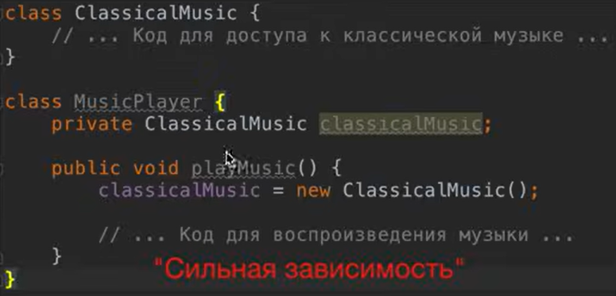

# Spring

# Spring Core

## IOC & Dependency injection

**IoC (Inversion of Control, инверсия управления)** обозначает принцип, при котором управление созданием и жизненным циклом объектов (бинов) передаётся **контейнеру Spring**, а не самому разработчику. Объект **не сам создаёт свои зависимости**, а **получает их извне.**

**Dependency Injection (внедрение зависимостей)** — это **способ передачи зависимостей объекту извне**, вместо того чтобы он сам их создавал. Это конкретная **реализация принципа IoC.**



**Сильная зависимость** — это когда один класс **жёстко связан** с конкретной реализацией другого класса.


При использовании слабой зависимости мы **не зависим от конкретной реализации**. И благодаря **IoC и DI** мы **внедряем объект извне**, благодаря чему не нужно постоянно перекомпилировать код.

Плюсы:

- **Слабая зависимость.** Классы не зависят от конкретных реализаций, можно легко заменить объект.
- **Лёгкая расширяемость**. Со временем можно легко добавлять реализации не ломая код.
- **Повторное использование кода**. Один и тот же бин может использоваться в разных частях приложения.
- **Гибкое управление бинами**. Можно поставить различные стратегии, жизненный цикл и тд.
- **Соответствие принципам SOLID**

---

## Bean scope

**Scope** - задает то, как Spring будет создавать ваши бины. Сколько экземпляров создаётся, кто ими владеет, как они разделяются между частями приложения

Виды scope:

- **Singleton** Scope, который используется по умолчанию. Создаёт один объект, ещё до вызова бина. При всех вызовах бина возвращается ссылка на один и тот же объект.
    
    
    
    Чаще всего используется тогда, когда у бина нет изменяемых состояний (stateless). Потому что при изменении бина, будет проблема у всех пользователей этого бина.
    
- **Prototype** Scope, который каждый раз создаёт новый объект при вызове бина
    
    
    
    Чаще всего используется тогда, когда у бина есть изменяемые состояния(stateful)
    

## Autowired

Есть различные виды Dependency injection:

- **Через конструктор**. Самый правильный и рекомендуемый
- **Через setter**.
- **Через поле**. (field injection) Используется реже, т.к. хуже для тестов

`@Autowired` используется для внедрения зависимостей через поле, через конструктор и через сеттер. Лучше всего внедрять через конструктор, потому что легче подставить mock bean, и не лезть в reflections. 

## Transactional

Аннотация предназначения **для управления транзакциями в Spring приложении.** Позволяет не писать код для открытия/закрытия вручную, а передаёт спрингу. Управляется с помощью Spring AOP.

Помечается над методом, или над классом. Во втором случае все методы класса будут transactional.

---

### Как работает в Spring

Когда Spring видит `@Transactional`, он:

1. Создаёт прокси-объект вокруг метода/класса. 
2. Перед вызовом метода открывает транзакцию.
3. Если метод завершился успешно — выполняет **commit**.
4. Если произошло неперехваченное исключение (обычно `RuntimeException` или `Error`) — выполняет **rollback**.


---

### Атрибуты

- `propagation` — стратегия вложенности транзакций:
    - `REQUIRED` (по умолчанию) — использовать существующую или создать новую.
    - `REQUIRES_NEW` — всегда новая транзакция.
    - `NESTED` — вложенные транзакции.
- `isolation` — уровень изоляции (например, `READ_COMMITTED`, `SERIALIZABLE`).
- `rollbackFor` — список исключений, при которых делать rollback (по умолчанию rollback при `RuntimeException`).
- `noRollbackFor` — исключения, при которых не нужно откатывать транзакцию.
- `readOnly` — оптимизация для операций только чтения. (По умолчанию false)
- `timeout` — ограничение времени выполнения транзакции.

---

### Proxy-объекты

Прокси просто открывает транзакцию, внутри вызывает метод класса и коммитит, или rollback. Есть две стратегии создания прокси объектов:

- Проксирование на основе интерфейсов. (JDK Dynamic proxy) Будет создаваться прокси объект реализующий интерфейс. Используется если target метод, или класс помечены final и от них нельзя наследоваться или переопределять


- Проксирование на основе классов (CGLIB Proxy). Используется если нету интерфейса который можно реализовать


---

**Важная особенность!** **`@Transactional`** не работает при вызове метода из того же класса. Это относится для создания транзакции внутри транзакции, и вызове метода внутри метода. Вот наглядный пример как это работает:

```java
// Ваш оригинальный класс
@Service
public class UserService {
    public void outerMethod() {
        this.innerMethod(); 
    }
    
    @Transactional
    public void innerMethod() {
        userRepository.save(user);
    }
}

// Spring создаёт что-то вроде этого (упрощённо)
public class UserService$Proxy extends UserService {
    private UserService target; // оригинальный объект
    
    @Override
    public void innerMethod() {
        transactionManager.begin();
        try {
            target.innerMethod(); // вызов оригинального метода
            transactionManager.commit();
        } catch (Exception e) {
            transactionManager.rollback();
            throw e;
        }
    }
    
    @Override
    public void outerMethod() {
        // НЕТ транзакционной логики, просто прокси
        target.outerMethod();
    }
}
```

## Почему самовызов не работает

Когда вызывается `outerMethod()`:

1. **Извне** → `proxy.outerMethod()` → вызов идёт на прокси
2. **Внутри `outerMethod`** → `this.innerMethod()` → `this` указывает на 
**оригинальный объект**, а не на прокси!
3. Поэтому `innerMethod()` вызывается напрямую, **минуя прокси** 
и его транзакционную обёртку
```
Извне: [Proxy] → outerMethod() на прокси → target.outerMethod()
                                                ↓
Внутри оригинального объекта:              this.innerMethod()
                                                ↓
                                           ПРЯМОЙ вызов, минуя [Proxy]!
```

# Spring WEB

## PathVariable

`@PathVariable` — эта аннотация **берет** **часть URL из пути и кладёт её в параметр метода контроллера**.

```java
@GetMapping("/users/{id}")
public ResponseEntity<String> getUser(@PathVariable Long id) { ... }

@GetMapping("/users/{userId}")
public ResponseEntity<String> getUser(@PathVariable("userId") Long id) { ... }
```

1. Здесь можно не указывать имя в `@PathVariable`, так как `id` совпадает с `{id}`.
2. Тут переменная пути называется `{userId}`, а параметр метода — `id`. Поэтому в `@PathVariable` нужно явно указать `"userId"`.

**Отличие от других аннотаций**

- `@RequestParam` → берет параметры **из query-параметров** (`/users?id=42`).
- `@PathVariable` → берет параметры **из части URL пути** (`/users/42`).

## Thymeleaf

Thymeleaf — это **Java-шаблонизатор для генерации HTML**, который:

- Позволяет использовать **динамические данные из Spring MVC**;
- Может работать как **на сервере**, так и **в статическом виде** (например, для разработки);
- Поддерживает **условия, циклы, вставку значений, форматы, URL и i18n**;
- Отличается тем, что HTML-шаблон остаётся валидным и читаемым в браузере даже без сервера.

### **Вставка данных из модели Spring**

```html
<p th:text="${[user.name](http://user.name/)}">Имя пользователя</p>
```

Будет выводиться “Имя пользователя” если модель пуста, или значение из модели

### Условные конструкции

```html
<div th:if="${user != null}">
Привет, <span th:text="${[user.name](http://user.name/)}">Пользователь</span>!
</div>
<div th:unless="${user != null}">
Пожалуйста, войдите
</div>
```

- `th:if` → отображается, если условие true
- `th:unless` → отображается, если условие false

### Доступ к параметрам запроса

```html
<div th:if="${param.error}">Ошибка логина!</div>
<div th:if="${param.logout}">Вы вышли</div>
```

- `param` → query-параметры URL (`?error`, `?logout`)
- Spring Security активно использует это для отображения ошибок/логина

# Spring Security


## Фильтр

С помощью фильтров можно  взаимодействовать с запросами и ответами HTTP. Точкой входа для обработки HTTP запроса является фильтр.


Входящие запросы проходят через фильтры в том порядке, в котором фильтры зарегистрированы в классе конфигурации. После этого запрос добирается до контроллера, в котором выполняется бизнес-логика. Некоторые фильтры защищают от эксплойтов, некоторые создают объекты типа `Authentication`

Чтобы создать свой фильтр нужно имплементировать интерфейс `Filter`, или `OncePerRequestFilter` (альтернатива от Spring) где должны реализовать метод `doFilter()` :

```java
public void doFilter(
	HttpServletRequest request,
	HttpServletResponse response,
	FilterChain chain
) {
	// 1. Before the request proceeds further (e.g. authentication or rejection)
	// ...

	// 2. Invoke the "rest" of the chain
	chain.doFilter(request, response);

	// 3. Once the request has been fully processed (e.g. cleanup)
	// ...
}
```

Чтобы добавить фильтр в цепочку Далее необходимо зарегистрировать фильтр в цепочке используя `addFilter()` . Также нужно не забыть вернуться в цепочку фильтров, иначе мы не дойдём до контроллера, используем `filterChain.doFilter(request, response)`

```java
class SecurityConfig {

	SecurityFilterChain securityFilterChain (HttpSecurity http) throws Exception {
				return http
        	.authorizeHttpRequests(
            	authorizeHttp -> {
                	authorizeHttp.requestMatchers("/").permitAll();
                	authorizeHttp.requestMatchers("/error").permitAll();
                	authorizeHttp.anyRequest().authenticated();
            	}
        	)
        	.formLogin(l -> l.defaultSuccessUrl("/private"))
        	.logout(l -> l.logoutSuccessUrl("/"))
        	.oauth2Login(withDefaults())
        	.addFilterBefore(new CustomFilter(), AuthorizationFilter.class)
        	.build();
	}
}
```

Созданные фильтры должны находиться до `AuthorizationFilter.class` . `AuthorizationFilter` — это уже **этап авторизации**, который срабатывает **после того, как пользователь аутентифицирован**.

---

## Authentication

Объект типа `Authentication` — это интерфейс, использующийся для аутентификации и авторизации. Когда пользователь вводит логин и пароль, spring security создаёт объект типа `Authentication`

**Аутентификация** — это процесс определения личности пользователя, его имя, дата рождения и т.д. 

**Авторизация** — это процесс определения того, что данному пользователю разрешено, например, можно ли ему входить в панель админа или удалять заказы.

`Object getPrincipal` — это пользователь, сущность, направляющая запрос, информация по его идентификации.

`boolean isAuthenticated()` - говорит: *"Этот объект — результат успешной аутентификации"*, а не просто попытка входа. По умолчанию false, будет выводить true для пользователей с не Anonymous-аутентификации.

`Object getDetails()` - Хранит дополнительные детали запроса на аутентификацию. Это может быть IP адрес, серийный номер сертификата и т.д. Возвращает дополнительные детали запроса на аутентификацию или `null`, если не используется.

`Object getCredentials` — это **доказательство подлинности**, которое пользователь предъявляет, чтобы подтвердить свою личность. Логин + пароль, токен, ключ, и тд. Когда `Authentication` объект попадает в ваш контроллер, `credentials` всегда будут равны `null`. Это потому, что `credentials` являются сферой ответственности безопасности, и не должны быть видимы в тех частях приложения, где идет работа с бизнес-логикой.


`Authentication` объекты хранятся в `SecurityContext`, поэтому существует класс `SecurityContextHolder`, у которого есть метод `getContext()`. Это статический метод, который возвращает `SecurityContext`, содержащий объект `Authentication`.

По сути, в нашем контроллере мы заинжектировали `Authentication` объект. Но можно также получить объект с помощью `SecurityContextHolder.getContext()`

```java
@GetMapping("/private")
public String privatePage(Model model, Authentication authentication) {

	var auth = SecurityContextHolder.getContext().getAuthentication();

	auth == authentication;

	model.addAttribute("name", getName(authentication));
	return "private";
}
```

Фильтр же для аутентификации пользователя выглядит иначе чем обычный. Первое — это решить, хотим ли мы применить фильтр. Второе — проверить `credentials` и на их основе аутентифицировать либо отклонить запрос. И третье — вызвать следующий фильтр.

```java
class AuthenticationFilter extends OncePerRequestFilter {

	@Override
	protected void doFilterInternal(HttpServletRequest request, HttpServletResponse response, FilterChain filterChain) {
    		// 1. Decide whether we want to apply the filter?
				if (!Collections.list(request.getHeaderNames()).contains("x-robot-secret")) {
					filterChain.doFilter(request, response);
					return;
				}
				
    		// 2. Check credentials and [authenticate | reject]
				if (!Objects.equals(request.getHeader("x-robot-secret"), "beep-boop")) {
					return "Rejected"
				}

				var auth = new RobotAuthenticationToken();
				var newContext = SecurityContextHolder.createEmptyContext();
				newContext.setAuthentication(auth);
				SecurityContextHolder.setContext(newContext);
				
    		// 3. Call next!
				filterChain.doFilter(request, response);
	}
}
```

# Spring Profile


# AOP

**Аспектно-ориентированное программирование** - это парадигма разработки ПО где делается **упор на реализации сквозной логики**. 

**Сквозная логика** - это логика которая **для разных компонентов имеет схожее поведение**. Например логирование (не зависит от компонента), транзакции, исключения и тд.