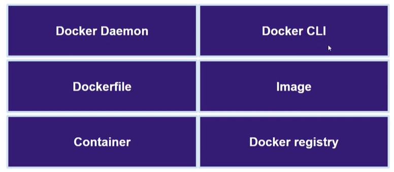
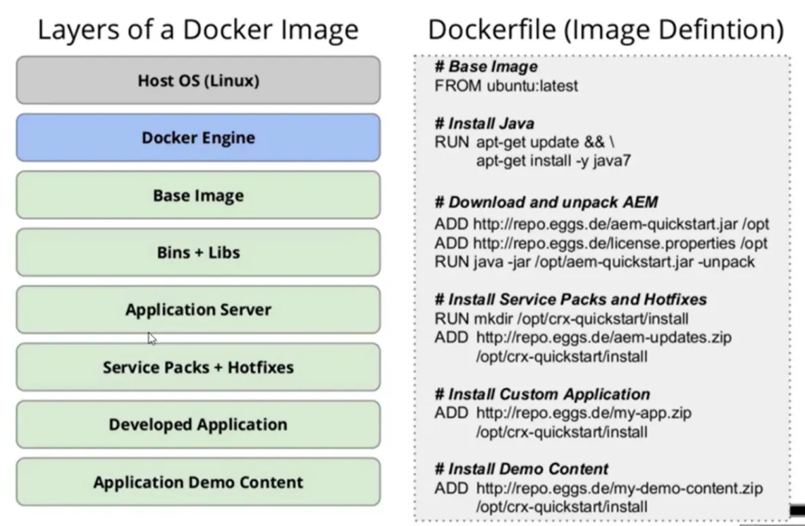

# Docker

**Docker** - это ПО для автоматизации развертывания и управления приложениями в средах с поддержкой контейнеризации

---

## Сравнение с VM

| **Критерий** | **Docker (Контейнеры)** | **Виртуальные машины (VM)** |
| --- | --- | --- |
| **Изоляция** | На уровне процессов и ядра (cgroups, namespaces) | Полная (гипервизор, собственная ОС) |
| **Ядро ОС** | Общее с хост-системой | Свое собственное (гостевая ОС) |
| **Размер** | Очень легкие (MB — сотни MB) | Тяжелее (обычно GB) |
| **Скорость запуска** | Почти мгновенно (мс–секунды) | Медленно (секунды–минуты) |
| **Управление ресурсами** | Гибкое: CPU, RAM, IO, через cgroups | Точное: гипервизор жестко выделяет ресурсы |
| **Производительность** | Почти нативная (малый overhead) | Ниже из-за виртуализации |
| **Безопасность** | Хорошая, но ядро общее (могут быть уязвимости) | Высокая: полная изоляция ядра и системы |
| **Поддержка разных ОС** | Только ОС, совместимые с ядром хоста (обычно Linux) | Любая ОС (Linux, Windows, BSD, etc.) |
| **Поддержка DevOps / CI/CD** | Отличная, легко интегрируется с пайплайнами | Сложнее и медленнее интегрировать |
| **Масштабируемость** | Очень высокая (идеально для микросервисов, Kubernetes) | Ограниченная, менее гибкая |
| **Портативность** | Отличная: образ запускается где угодно (если есть Docker) | Ограниченная: зависит от гипервизора и образа |
| **Инфраструктура как код** | Простая: `Dockerfile`, `docker-compose`, Helm и т.д. | Сложнее: Vagrant, Ansible, Terraform для VM |
| **Использование в проде** | Отлично подходит, особенно с Kubernetes | Подходит для изолированных, тяжелых приложений |
| **Обновления и откаты** | Быстрое пересоздание контейнеров с новыми образами | Медленно, требуется пересборка образа ОС |
| **Типичные сценарии** | Микросервисы, CI/CD, DevOps, облачные приложения | Монолитные приложения, изоляция legacy систем |

## Из чего состоит Docker

- **Docker Daemon** - **это центральный компонент Docker, который выполняет всю "тяжелую" работу под капотом.** Он работает в фоновом режиме как **сервер**, и именно он **управляет всеми объектами Docker:** контейнерами, образами, томами, сетями и т.п.
- **Docker CLI** - командная строка, через неё подаются команды docker daemon.
- **Dockerfile** - это инструкция, по которой docker собирает образ.
- **Image** - docker образы по которым запускается контейнер. (Можно привести аналогию что image это класс, а container это объект класса, то есть по одному image можно сделать много контейнеров)
- **Container** - это изолированная, переносимая среда, в которой запускается приложение со всеми его зависимостями.
- **Docker registry** - можно сказать это центральный репозиторий образов.

## Dockerfile

Образ состоит из слоёв, чем выше слой тем более он фундаментален. При обновлении образа он будет перезаписывать только те слои ,которые изменились, благодаря кешированию.

---

**Основные команды:**

| Команда | Назначение | Пример |
| --- | --- | --- |
| `FROM` | Указывает базовый образ | `FROM openjdk:17-alpine` |
| `LABEL` | Добавляет метаданные | `LABEL maintainer="you@example.com"` |
| `ENV` | Устанавливает переменные окружения | `ENV DB_HOST=localhost` |
| `WORKDIR` | Устанавливает рабочую директорию | `WORKDIR /app` |
| `COPY` | Копирует файлы с хоста в контейнер | `COPY target/app.jar /app/app.jar` |
| `ADD` | Как `COPY`, но ещё умеет извлекать архивы и качать по URL | `ADD app.tar.gz /app/` |
| `RUN` | Выполняет команду на этапе сборки | `RUN apt-get update && apt-get install -y curl` |
| `CMD` | Команда по умолчанию при запуске контейнера | `CMD ["java", "-jar", "app.jar"]` |
| `ENTRYPOINT` | Устанавливает основную команду (не переопределяется `docker run`) | `ENTRYPOINT ["java", "-jar", "app.jar"]` |
| `EXPOSE` | Документирует, на каком порту работает приложение | `EXPOSE 8080` |
| `VOLUME` | Создаёт точку монтирования для volume | `VOLUME /data` |
| `ARG` | Определяет переменную, доступную только на этапе сборки | `ARG JAR_FILE=app.jar` |
| `USER` | Определяет пользователя внутри контейнера | `USER appuser` |
| `HEALTHCHECK` | Настраивает проверку "живости" контейнера | `HEALTHCHECK CMD curl --fail [http://localhost:8080](http://localhost:8080/) |
| `SHELL` | Задаёт интерпретатор команд (например, `/bin/bash`) | `SHELL ["/bin/bash", "-c"]` |
| `ONBUILD` | Указывает триггер для дочерних образов | `ONBUILD COPY . /app` |
| `STOPSIGNAL` | Указывает сигнал остановки контейнера | `STOPSIGNAL SIGTERM` |

## Docker Image

- Контейнеры запускаются из образов
- Хранятся в registry
- У каждого есть свой hash, name, tag
- Состоят из слоев
- Строятся по инструкции Dockerfile

---

| **Команда** | **Предназначение** |
| --- | --- |
| `docker build -t имя_образа:тег .` | Для создания image. -t означает установка тега. Точка обозначает путь к dockerfile по которому собирается образ |
| `docker images` | Просмотр всех image |

## Docker Registry

Можно сказать что это maven только для образов, также есть центральный репозиторий, и есть локальный где хранятся образы.

- Хранит образы
- Dockerhub - центральный репозиторий всех образов

---

| Команда | Предназначение |
| --- | --- |
| `docker pull имя-образа` | Загружает образ из удалённого репозитория |
| `docker login` | Вход в dockerhub |
| `docker tag имя-образа username/имя-репозитория` | Указывается тег удалённого репозитория |
| `docker push username/имя-репозитория` | Отправка в удалённый репозиторий |

## Docker Container

- Запускается из образа
- Изолирован от других контейнеров
- Содержит в себе все необходимое для работы
- В идеале 1 процесс = 1 контейнер

---

| Команда | Что делает | Когда использовать |
| --- | --- | --- |
| `docker run метка-образа` | **Запускает контейнер** по образу. Если образ не найден в локальном хранилище, будет загружен из dockerhub | При запуске контейнера |
| `docker stop идентификатор` | **Останавливает контейнер** по идентификатор | При остановке контейнера |
| `docker exec` | Запускает **новую команду внутри** контейнера | Для входа в контейнер, отладки |
| `docker attach` | Подключается к **основному процессу** контейнера | Чтобы следить за `stdout`, `stdin` |

Флаги должны идти до метки образа

`-t` - запуск псевдо-терминала

`-i` - интерактивный режим

`-d` - запускает контейнер в фоновом режиме

`-p` - пробрасывание портов, 8080:80 первый порт - порт хоста, второй порт контейнера

## Docker compose

Docker compose - это инструмент который позволяет управлять несколькими контейнерами как единым целым. Вся настройка происходит в файле конфигурации `docker-compose.yaml` 

Сначала необходимо указать все сервисы контейнеры которых будут запущены, потом в сервисе указать начальный образ. 

Если необходимо хранить данные на хосте, то можно присоединять тома к контейнеру через `volumes:`. Отдельно регистрируя их.

---

### Несколько docker compose

По умолчанию ищется файл `docker-compose.yml` в текущей директории.

Указание конкретного файла: `docker compose -f my-compose.yml up` . Таким образом можно запустить несколько docker compose файлов