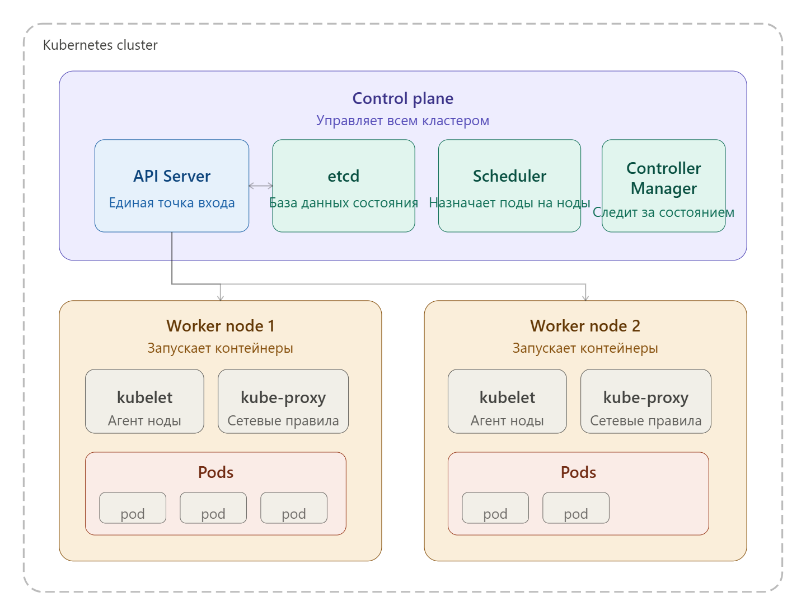
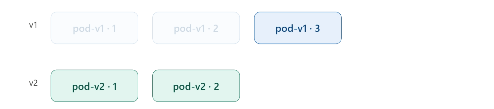
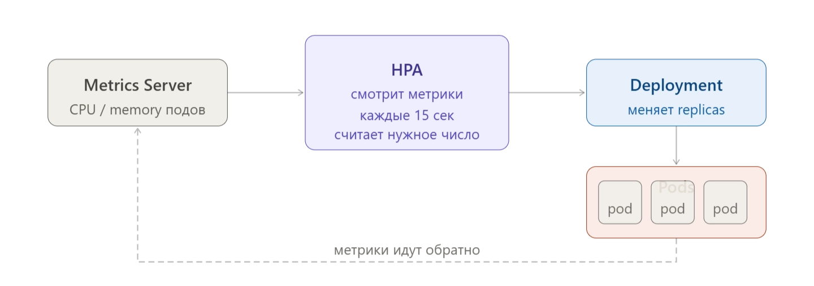

# Kubernetes

# Kubernetes: что это и зачем нужен

**Kubernetes (K8s)** — это платформа для оркестрации контейнеров. Система, которая управляет запуском, масштабированием и работой контейнеризированных приложений в кластере серверов.

Основные понятия:

- **Cluster** - набор нод, которые работают вместе под управлением K8s
- **Node** - узел. Физический сервер на котором установлен K8s и подключен к сети
- **Pod** - минимальный объект K8s в котором работают один или более контейнеров
- **Deployment** - это объект, который описывает **желаемое состояние**
- **Service -** стабильный сетевой адрес для подов

### Ключевые возможности

| Возможность | Что делает |
| --- | --- |
| **Self-healing** | Перезапускает упавшие контейнеры, заменяет "больные" ноды |
| **Auto-scaling** | Добавляет/убирает реплики приложения под нагрузку |
| **Rolling updates** | Обновляет приложение без даунтайма, бесшовно |
| **Load balancing** | Распределяет трафик между репликами |
| **Service discovery** | Сервисы находят друг друга по имени, не по IP |
| **Secret management** | Хранит пароли и конфиги отдельно от кода |

# K8s Cluster

**Кластер** — это набор машин (серверов или виртуалок), которые работают вместе под управлением Kubernetes. Ты общаешься с кластером как с единым целым, а K8s сам решает, что где запустить.
**Минимальный набор для кластера - 1 master и 1 worker nodes.** Далее можно увеличивать как кол-во master node, так и кол-во worker node.

### Архитектура кластера:



---

### Поднятие кластера

Поднять кластер можно несколькими способами:


- **kubeadm** —  это официальный инструмент для развёртывания настоящего Kubernetes. Он не делает ничего сам: ты сам готовишь ОС, сеть, контейнерный рантайм, а kubeadm лишь правильно связывает все компоненты вместе. Используется для production-серверов.
    
    ```bash
    # Инициализация master-узла
    # Настраивает k8s, делает конфиг файл
    kubeadm init --pod-network-cidr=10.244.0.0/16
    
    # Настройка kubectl после init
    mkdir -p $HOME/.kube
    cp /etc/kubernetes/admin.conf $HOME/.kube/config
    
    # Добавление worker-узла в кластер
    kubeadm join <master-ip>:6443 --token <token> 
    		--discovery-token-ca-cert-hash sha256:<hash>
    ```
    
- **minikube** — "кластер из коробки" для локальной разработки. Запускает один узел (или несколько) внутри VM или Docker. Из плюсов — встроенный dashboard, addons (Ingress, MetalLB и др.), простой старт командой `minikube start`. Из минусов — тяжелее и медленнее, чем kind.
    
    ```bash
    minikube start                          # Запустить кластер
    minikube start --nodes=3               # Мультинодовый кластер
    minikube stop / delete                 # Остановить / удалить
    ```
    

---

### Основные команды

| **Команда** | **Что делает** |
| --- | --- |
| `kubectl version` | Версия kubctl client и сервера |
| `kubctl get componentstatuses` | Показать состояние K8s Cluster |
| `kubectl cluster-info` | Информация о K8s Cluster |
| `kubectl get nodes` | Показать все nodes K8s Cluster |
| `kubectl get nodes -o wide` | Выводит подробную информацию по кластеру |

# Master node

**Master node** - сервер который управляет worker nodes. На этом сервере устанавливается Control Plane управляющий кластером.

---

### Control Plane (управляющий узел)

"Мозг" кластера. Принимает решения: что где запускать, сколько реплик держать, как реагировать на сбои. Пользователь никогда не запускает свои приложения на Control Plane — только служебные компоненты (В теории можно, но лучше не стоит).

Состоит из:

- **API Server** — единственная точка входа во весь кластер. Все команды (от тебя через `kubectl`, от других компонентов) идут через него.
- **etcd** — распределённая база данных "ключ-значение". Хранит всё состояние кластера: сколько реплик запущено, какие конфиги, какие секреты. Если etcd умрёт — кластер потеряет память о себе.
- **Scheduler** — следит за новыми подами без назначенной ноды и решает, на какой воркер их запустить. Учитывает ресурсы, ограничения, affinity-правила.
- **Controller Manager** — запускает контроллеры, которые следят за тем, чтобы текущее состояние совпадало с желаемым. Например: "должно быть 3 реплики → сейчас 2 → создаю третью".

# Worker node

**Worker node** - сервер на котором работают pods. Узлов может быть сколько угодно — от одной до тысяч.

На каждой воркер-ноде есть:

**kubelet** — агент, который общается с API Server и следит за тем, чтобы нужные поды были запущены именно на этой ноде.

**kube-proxy** — настраивает сетевые правила (iptables/ipvs), чтобы трафик правильно маршрутизировался между подами и сервисами.

**Container runtime** — движок для запуска контейнеров (обычно containerd или CRI-O). Kubernetes сам контейнеры не запускает — он делегирует это рантайму.

# Pods

**Pod** - **обёртка над одним или несколькими контейнерами**, которые: разделяют одну сеть (один IP-адрес на всех), разделяют тома (volumes), всегда запускаются на одной ноде. 


**Pod** - минимальная единица, и **он смертен**. Kubernetes может убить его в любой момент — при обновлении, при нехватке ресурсов, при переезде на другую ноду. У пода нет постоянного IP, нет гарантии выживания. Именно поэтому поды как правило не создают вручную — для этого есть Deployment.

Для создания пода вручную можно написать команду(ниже), или написать инструкцию(манифест) после чего отдать ее K8s. **Манифест пода:**

```yaml
apiVersion: v1
kind: Pod
metadata:
  name: my-app
  labels:                # Метки
	  app: my-app
	  env: test
spec:
  containers:
    - name: app
      image: nginx:1.25
      ports:
        - containerPort: 8080
```

**Команды:**

| **Команда** | **Что делает** |
| --- | --- |
| `kubectl get pods` | Выводит все активные поды |
| `kubectl describe pods` | Выводит подробную информацию по подам (можно указать одну) |
| `kubectl exec -it имя-пода команда` | Выполняет команду в поде в интерактивном режиме (Как в docker container) |
| `kubectl logs имя-пода` | Вывод логов пода |
| `kubectl delete pods имя-пода` | Удаляет под |
| `kubectl port-forward имя-пода хост-порт:под-порт` | Перенаправление порта хоста на порт пода |
| `kubectl apply -f имя-манифеста.yaml` | Загрузить манифест пода в K8s |
| `kubectl run имя-пода --image=nginx --port=80` | Запуск пода с указанием image и указанием порта |

# Deployment

**Deployment** — это объект, который описывает **желаемое состояние**: какой образ запускать, сколько реплик держать, как обновлять. А Controller Manager следит за тем, чтобы реальность совпадала с желаемым.

Основные функции deployment:

- Декларативное управление состоянием
- Управление ReplicaSet
- Обновления (Rolling Updates)
- Откаты (Rollback)
- Масштабирование (Scaling)
- Самовосстановление (Self-healing)

---

### ReplicaSet

Deployment не следит самостоятельно за количеством под, он создаёт `ReplicaSet`, а `ReplicaSet` следит за тем, чтобы нужное число подов всегда было живым. Если один под упал — ReplicaSet тут же создаёт новый.


**Манифест deployment:**

```yaml
apiVersion: apps/v1
kind: Deployment
metadata:
  name: my-app
spec:
  replicas: 3                # сколько подов держать
  selector:
    matchLabels:
      app: my-app            # ReplicaSet найдёт "свои" поды по этому лейблу
  template:                  # шаблон пода
    metadata:
      labels:
        app: my-app
    spec:
      containers:
        - name: app
          image: nginx:1.25
          ports:
            - containerPort: 8080
          resources:          # Опционально можно указать сколько 
            requests:         # ресурсов использовать
              cpu: "100m"           # 0.1 ядра — минимум для планирования
              memory: "128Mi"
            limits:
              cpu: "500m"
              memory: "256Mi"
```

### Rolling update — обновление без даунтайма

При новой версии deployment, Kubernetes не убивает все поды сразу — он создаёт новый ReplicaSet и плавно переносит трафик.



В любой момент обновления в кластере есть поды обеих версий, и трафик не прерывается. Если что-то пошло не так — откат одной командой: `kubectl rollout undo deployment/my-app`.

Основные команды:

| **Команда** | **Что делает** |
| --- | --- |
| `kubectl apply -f название.yaml` | Создать Deployment из манифеста |
| `kubectl set image deployment/имя-deployment app=новый-image` | Обновить образ |
| `kubectl rollout status deployment/my-app`  | Следить за процессом обновления |
| `kubectl rollout undo deployment/my-app` | Откат к предыдущему REVISION. Можно выбрать конкретную версию |
| `kubectl delete -f название.yaml` | Удаление deployment по файлу |

### Scaling - масштабирование подов

Есть три варианта масштабировани:

#### Ручное масштабирование

Самый простой способ — сказать кластеру напрямую сколько реплик нужно:

```bash
# Изменить число реплик
kubectl scale deployment my-app --replicas=5

# Или обновить манифест и применить
kubectl apply -f deployment.yaml   # где replicas: 5

# Отслеживания прогресса обновления
kubectl rollout status
```

Kubernetes сразу создаст нужное число подов (или уберёт лишние), используя rolling update. 

#### HPA — Horizontal Pod Autoscaler

HPA следит за метриками и сам меняет число реплик. Метриками могут быть как CPU, память, так и RPS и любые другие кастомные метрики.



HPA работает в цикле: каждые 15 секунд смотрит на метрики, вычисляет нужное число реплик и обновляет `replicas` в Deployment. Для работы HPA обязательно нужен `metrics-server` или prometheus, в кластере и заданные `resources.requests` у контейнера — без них HPA не знает, от чего считать проценты.

# Service

**Service** - модуль который **даёт стабильный адрес** для живых подов и балансирует трафик между ними. Поды - смертные, и их ip меняется при каждом перезапуске - service решает эту проблему.

**Ключевой механизм — не имена, а метки**. Service не знает про конкретные поды по имени. Он смотрит на `selector` и выбирает все поды, у которых совпадают лейблы. Поды приходят и уходят, а Service просто в любой момент опрашивает кластер: "кто сейчас живой с лейблом `app: my-app`?"

**Есть 4 типа Service:**

#### **ClusterIP — только внутри кластера**

Тип по умолчанию. Создаёт виртуальный IP, доступный только внутри кластера. Для взаимодействия микросервисов между собой: frontend → backend, backend → database. Снаружи кластера недоступен совсем.

`type: ClusterIP`

`# доступ: my-service.default.svc.cluster.local`

#### **NodePort — порт на каждой ноде**

Открывает фиксированный порт (30000–32767) на каждой ноде кластера. Трафик на : попадает в Service. Удобно для разработки и тестирования, но не для продакшена — IP нод нестабильны, порты неудобны.

`type: NodePort`

`nodePort: 30080 # доступ: <любая-нода>:30080`

#### **LoadBalancer — внешний балансировщик**

Просит облачного провайдера (AWS, GCP, Azure) создать внешний Load Balancer с публичным IP. Это основной способ открыть приложение в интернет в облачных кластерах. В голом bare-metal кластере нужен metallb или аналог.

`type: LoadBalancer`

`# провайдер создаёт внешний IP автоматически`

#### **Headless — без виртуального IP**

Указываешь clusterIP: None — и Kubernetes не создаёт виртуальный IP вообще. DNS-запрос возвращает адреса всех подов напрямую. Используется для StatefulSet (базы данных, Kafka) — когда нужно обращаться к конкретному поду, а не к случайному.

`clusterIP: None`

`# DNS отдаёт A-записи каждого пода`

# Ingress

# Полезные ссылки

Видео курс по Kubernetes - [https://www.youtube.com/watch?v=q_nj340pkQo&list=PLg5SS_4L6LYvN1RqaVesof8KAf-02fJSi](https://www.youtube.com/watch?v=q_nj340pkQo&list=PLg5SS_4L6LYvN1RqaVesof8KAf-02fJSi)

Training & Certification - [https://www.cncf.io/training/](https://www.cncf.io/training/)

Kubernetes training - [https://training.play-with-kubernetes.com/kubernetes-workshop/](https://training.play-with-kubernetes.com/kubernetes-workshop/)

Ingress Controllers - [https://docs.google.com/spreadsheets/d/191WWNpjJ2za6-nbG4ZoUMXMpUK8KlCIosvQB0f-oq3k/edit?gid=907731238#gid=907731238](https://docs.google.com/spreadsheets/d/191WWNpjJ2za6-nbG4ZoUMXMpUK8KlCIosvQB0f-oq3k/edit?gid=907731238#gid=907731238)