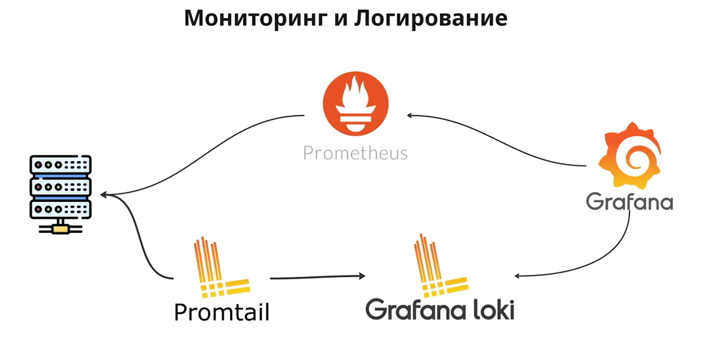

# Метрики, логи



# Метрики

Метрики — это **числовые показатели**, которые описывают состояние приложения, сервера или системы. Метрики — это измерения, которые система собирает и по которым можно судить о её здоровье. Также можно делать бизнес-метрики для отслеживания каких то процессов

---

## Prometheus

Prometheus используется для сбора метрик (собственных, или встроенных). Он обходит приложение, и по пути `/metrics` получает метрики от приложения и сохраняет их у себя. (15-30 дней).

Для настройки prometheus необходимо составить `prometheus.yml` 

```yaml
# Блок global который определяет настройки для всех job если не переопределить
global:
  scrape_interval: 15s     # как часто собирать метрики (по умолч. 1 минута)
  evaluation_interval: 15s # как часто пересчитывать алерты и recording rules

# Набор целевых сервисов для сбора метрик
scrape_configs:
	# Несколько сервисов - несколько job
  - job_name: 'spring-boot-app'
    metrics_path: '/actuator/prometheus'
    # Список хостов и портов
    static_configs:
      - targets: ['host.docker.internal:8080']
```