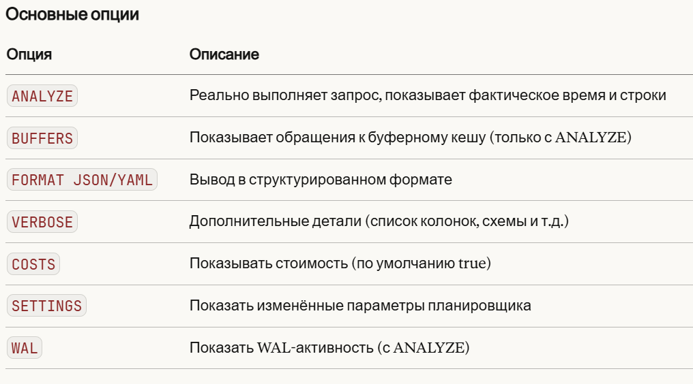

# SQL

## Ключевые слова

- `PRIMARY KEY` — уникальный идентификатор строки (не NULL, только один на таблицу).
- `FOREIGN KEY` — ссылка на `PRIMARY KEY` в другой таблице. обеспечивает связность данных и ссылочную целостность.
- `UNIQUE` — гарантирует, что все значения в столбце уникальны (может быть NULL)

## ACID

**ACID** — это набор свойств транзакций в системах управления базами данных, которые гарантируют корректность и надежность выполнения операций.

- **Atomicity (Атомарность)**
    - Транзакция выполняется целиком или не выполняется вовсе.
    - Если в процессе возникает ошибка, все изменения откатываются.
- **Consistency (Согласованность)**
    - После завершения транзакции база данных должна оставаться в корректном состоянии, не нарушая правил, ограничений и связей.
- **Isolation (Изолированность)**
    - Одновременное выполнение транзакций не должно приводить к неправильным результатам.
    - Каждая транзакция "видит" базу так, как будто она выполняется одна.
- **Durability (Надёжность/Долговечность)**
    - Результаты успешно завершенной транзакции сохраняются в системе и не теряются даже в случае сбоев (например, при отключении питания).

---

### Уровни изоляции:

- **Read Uncommitted**
    - Можно читать «грязные» данные (uncommitted изменения других транзакций).
    - Риски: *dirty read, non-repeatable read, phantom read*.
    - В реальных СУБД почти не используется.
- **Read Committed**
    - Можно читать только закоммиченные данные.
    - Исключает *dirty read*.
    - Но возможны *non-repeatable read* (одно и то же SELECT в рамках транзакции может дать разные результаты) и *phantom read*.
- **Repeatable Read**
    - Гарантируется, что повторное чтение одних и тех же строк в транзакции даст одинаковый результат.
    - Исключает *dirty read* и *non-repeatable read*.
    - Но возможны *phantom read* (появление новых строк, удовлетворяющих условию).
- **Serializable**
    - Максимальная изоляция: транзакции выполняются так, как если бы они шли последовательно.
    - Исключает все аномалии (*dirty, non-repeatable, phantom*).
    - Но сильно падает производительность: много блокировок или конфликтов.

---

Также в СУБД есть **механизмы блокировки данных** (как монитор в многопоточке). Потоки ничего не знают друг о друге, но благодаря ROW LOCK они ведут себя как потоки.

## Первичный ключ

Первичный ключ (PRIMARY KEY) — это ограничение, которое однозначно идентифицирует каждую строку в таблице. Он автоматически создаёт уникальный индекс и запрещает NULL.

Для создания указывается тип ключа, и ключ слово **`PRIMARY KEY`**

```sql
CREATE TABLE users(
	id BIGSERIAL PRIMARY KEY
);
```

По типу ключи делятся на **простой** и **составной.** 

Есть разные способы генерации ключей:

- **SERIAL / BIGSERIAL** — классический автоинкремент (на самом деле это sequence под капотом). Используются в обычном приложении. Hibernate использует при генериции табличек с **`GenerationType.IDENTITY`**
- **GENERATED ALWAYS AS IDENTITY** — современный стандартный способ (PostgreSQL 10+), предпочтительнее SERIAL.
- **UUID** — глобально уникальный идентификатор, удобен для распределённых систем.

---

### Последовательности

Sequence — это специальный объект БД, который генерирует уникальные числа по порядку. Именно на них основаны `SERIAL`, `BIGSERIAL` и `IDENTITY`.

Можно создавать свои последовательности:

```sql
-- С параметрами
CREATE SEQUENCE my_seq
    START WITH 1       -- начальное значение
    INCREMENT BY 1     -- шаг
    MINVALUE 1         -- минимум
    MAXVALUE 9999999   -- максимум
    CACHE 10           -- сколько значений кэшировать
    CYCLE;             -- начинать заново после MAXVALUE (по умолчанию NO CYCLE)
```

После миграции данных, последовательности id разные. Для того чтобы указать с какого значения необходимо создавать новые записи используем:

**`SELECT setval('my_seq', 100, true);`**

## Транзакции

**Транзакция - это единая логическая единица работы**. Все операции внутри транзакции либо выполняются успешно, и их результаты фиксируются в базе данных, либо в случае сбоя ни одна из операций не оказывает влияния на базу.

Для создания транзакции: 

**`START TRANSACTION;`**

Для фиксирования изменений: 

**`COMMIT;`**

Для отката изменений:

**`ROLLBACK;`**

Также можно указать уровень изоляции (по стандарту READ COMMITED)

**`START TRANSACTION ISOLATION LEVEL уровень-изоляции;`**

## JOIN

### JOIN

JOIN используется для объединения строк из двух или более таблиц на основе значения, связанного столбца между ними.

- INNER JOIN. Возвращает **только те записи**, для которых есть **совпадение в обеих таблицах**. Это самый распространенный тип JOIN.
- LEFT JOIN. Возвращает только записи из левой таблицы и совпадающие записи из правой. Если в правой таблице нет совпадения, то будет null.
- FULL OUTER JOIN. Возвращает все записи, когда есть совпадения из левой, и правой таблице. Комбинация left и right join

Для подключения таблицы используется синтаксис: 
**`JOIN table t ON [e.id](http://e.id) = t.id`**

Также если первичный ключ из двух таблиц имеет одно и тоже имя, можно использовать **`USING (id)`** вместо **`ON`**

## Агрегатные функции

Функции, возвращающие **единственное значение для набора строк**, называются **агрегатными**.

- `avg(выражение)` - арифметическое среднее;
- `min(выражение)` - минимальное значение выражения;
- `max(выражение)` - макcимальное значение выражения;
- `sum(выражение)` - сумма значений выражения;
- `count(*)` - количество строк в результате запроса;
- `count(выражение)` - количество значений выражения, не равных `NULL`.

Если в `SQL` запросе не используется `GROUP BY`, то значение агрегатной функции вычисляется **по всем строкам, полученным в результате выполнения инструкций `FROM` и `WHERE`.**

Чтобы вызвать агрегатную функцию необходимо указать ее в списке выборки (после `SELECT`). Если в `SELECT` **использована хотя бы одна агрегатная функция, то значениями других столбцов могут быть только вызовы агрегатных функций, либо константы.**

У функции `count` есть еще одна форма - `count(DISTINCT выражение)`. При такой форме записи функция вернет количество уникальных значений, при этом `NULL` значения по прежнему не учитываются.

---

### GROUP BY

Значение агрегатной функции можно вычислять не по всем строкам, полученным после соединения таблиц и применения условий `WHERE`, а по группе строк. Примером такой задачи может служить поиск минимальной стоимости для каждого товара по всем магазинам.

Для выполнения группировки строк необходимо добавить предложение `GROUP BY` после предложений `FROM` и `WHERE`.

---

### HAVING

HAVING — это условие фильтрации для агрегированных данных. Работает похоже на `WHERE`, но применяется **после** группировки. Используется с `GROUP BY`, когда нужно отфильтровать результаты по агрегатным функциям (`COUNT`, `SUM`, `AVG`, `MAX`, `MIN`). 

## Подзапросы

Подзапрос - это запрос в запросе. Подзапросы могут использоваться в любой части основного запроса. Есть несколько типов подзапросов:

- Возвращающий одно значение (single-row subquery или подзапрос одиночной строки)

---

# Оптимизация

## Как хранятся файлы в Postgres

**Основная единица хранения** — страница размером **8 КБ** (по умолчанию). Все чтение/запись происходит постранично. Считать 1 строку нельзя, будет считываться целая страница где есть эта строка.

Далее postgres помещает странички в буферный кеш, чтобы не читать постоянно из диска.

**TOAST** (The Oversized-Attribute Storage Technique) - текстовые данные больше 8КБ не помещаются в страничку и их кладут в отдельную таблицу TOAST, в основной таблице хранится ссылка на TOAST-табличку.

### Best practice

- Использовать связь one-to-one вместо создания широких таблиц
- Данные для частого сценария стоит хранить в одной таблице, а остальные в других (Т.к. легче считать одну страничку)
- Указывать данные которые нужны, не все (т.к. будут подтягивать все данные, и из TOAST-таблички и тд.)

## EXPLAIN

**`EXPLAIN`** показывает план выполнения запроса — что именно PostgreSQL собирается делать (или сделал) для его выполнения. Полезен для нахождения неэффективных запросов, понять куда накинуть индекс и т.д. Дописывается перед запросом: 

```sql
EXPLAIN SELECT * FROM orders WHERE user_id = 42;
EXPLAIN (опции) запрос;
```



Чаще всего применимы **`(ANALYZE, BUFFERS)`**

```sql
### Как читать вывод

Seq Scan on orders  (cost=0.00..4321.00 rows=950 width=64)
                          │        │       │        └─ средний размер строки (байт)
                          │        │       └─ оценка числа строк
                          │        └─ стоимость получения последней строки
                          └─ стоимость получения первой строки (startup cost)
 При ANALYZE         (actual time=0.042..18.3 rows=1020 loops=1)
                                  │            │         └─ сколько раз узел выполнялся
                                  │            └─ фактических строк
                                  └─ фактическое время (мс)
 При BUFFERS  Buffers: shared hit=45 read=12 dirtied=2 written=1
						                  │       │        │          └─ страниц вытеснено на диск из shared_buffers
						                  │       │        └─ страниц помечено как изменённых (грязные)
						                  │       └─ страниц прочитано с диска (кеш-промах)
						                  └─ страниц найдено в shared_buffers (кеш-попадание)
```

У планировщика есть разные способы сканирования таблицы. Postgres сам подбирает нужный способ исходя из многих параметров: селективность, общее кол-во строк, и тд.

- `Seq Scan` - полный перебор (нет индекса или запрос возвращает >10–15% строк таблицы (seq scan выгоднее))
- `Index Scan` - есть подходящий индекс, читает heap за каждой строкой
- `Index Only Scan` - все нужные данные есть в индексе, heap не читает (тогда в индексе нужно добавлять эти поля через **`INCLUDE`**)
- `Bitmap Heap Scan` - проходит по индексу и собирает bitmap, потом читает heap блоками (компромисс между seq scan и index scan)

Также разные способы соединения таблиц:

- `Nested Loop` - маленькие таблицы, есть индекс на внутренней
- `Hash Join` - одна таблица влезает в память (hash_mem_multiplier * work_mem)
    - `Merge Join` - оба входа уже отсортированы

---


## Индексы

**Индекс** - это сущность в БД которая представляет из себя **определённую структуру данных (Balanced Tree, Hash и тд.)** **максимально оптимизированных** для поиска. Без индекса любой поиск — это Seq Scan: Postgres читает каждую строку таблицы. При миллионе строк это медленно.

В postgres индекс реализован в виде “содержания” в книге. Открываем страничку содержания и далее находим нужную страничку.

**Индекс — не бесплатно**. При каждом `INSERT / UPDATE / DELETE` Postgres обновляет все индексы на таблице. Чем больше индексов — тем медленнее запись. Поэтому индексы нужно создавать осознанно, а не на все колонки подряд.

**Индекс будет работать при высокой селективности**

**Селективность** - это доля выбираемых строк. Отношение выбранных строк к общему кол-ву. Высока селективность означает, что выбирается малая часть всех строк

Есть несколько типов индексов:

- **B-tree (основной индекс)**
Поддерживает операции: `=`, `<`, `>`, `<=`, `>=`, `BETWEEN`, `LIKE 'foo%'` (префикс).
    
    ```sql
    CREATE INDEX ON orders (user_id);
    ```
    Сбалансированное дерево. Все листовые узлы на одинаковой глубине, 
    каждый лист хранит **(ключ → ctid)**, где ctid — физический адрес строки в heap.
    ```
              [1,      7,     13]
             /         |         \
         [2, 5]      [8, 11]      [14, 17]
        / |   \     / |   \        / \    \
      [3]↔[4]↔[6]↔[9]↔[10]↔[12]↔[15]↔[16]↔[18] ← листья: (значение, ctid)
    
    ```
    
    Каждая страница индекса (8 КБ) имеет параметр `fillfactor` (по умолчанию 90% для B-tree). Пока страница не заполнена на 90% — новые ключи просто добавляются в неё (рост "вширь" внутри страницы). *Скорость O(log n)*
    
- **Hash индекс**
Хранит `hash(значение) → ctid`. Очень быстрый для `=`, но **не поддерживает** диапазоны (`>`, `<`, `BETWEEN`). На практике используется редко — B-tree почти всегда не хуже. *Скорость O(1)*
    
    ```sql
    CREATE INDEX ON orders USING hash (user_id);
    ```
    
- **Составной индекс**
Работает для запросов по `user_id` или по `user_id + created_at`. Но **не работает** если в запросе только `created_at` — это важно. Порядок колонок имеет значение.
    
    ```sql
    CREATE INDEX ON orders (user_id, created_at);
    ```
    
- **GIN (Generalized Inverted Index)**
    
    Инвертированный индекс — как в поисковиках. Для каждого элемента (слова, тега) хранит список документов где он встречается. Хорош когда одна строка содержит много значений. Обычный индекс отвечает на вопрос "где лежит строка с этим значением". GIN отвечает на вопрос "в каких строках встречается этот элемент".
    
    ```sql
    --- Массивы
    CREATE INDEX ON articles USING gin (tags);   
    
    --- Full-text search
    CREATE INDEX ON articles USING gin (to_tsvector('russian', body));
    
    -- jsonb_ops (по умолчанию) — индексирует ключи и значения
    CREATE INDEX ON events USING gin (payload jsonb_ops);
    
    -- jsonb_path_ops — только @>, но меньше размер и быстрее
    CREATE INDEX ON events USING gin (payload jsonb_path_ops);
    ```
    
    Из минусов: очень тяжелый и медленная вставка, потому что каждый элемент индексируется отдельно
    
- **GiST (Generalized Search Tree)**
    
    Обобщённое дерево поиска. Используется для сложных типов: геометрия, диапазоны, full-text. Поддерживает пересечение, вхождение, близость.
    
    ```sql
    CREATE INDEX ON events USING gist (period);         -- диапазоны
    CREATE INDEX ON points USING gist (location);       -- геометрия, PostGIS
    ```
    
- **BRIN (Block Range Index)**
    
    Работает только если данные физически упорядочены (например, append-only таблица логов с временной меткой). Занимает минимум места, но неточный — потом нужен Recheck.
    
    ```sql
    CREATE INDEX ON events USING brin (created_at);
    ```
    
    Очень маленький индекс. Хранит не каждое значение, а **min/max по диапазону страниц**:
    ```
    страницы 0–127:   created_at от '2024-01-01' до '2024-01-15'
    страницы 128–255: created_at от '2024-01-15' до '2024-02-01'
    ...
    ```
    
- **Partial Index (частичный индекс)**
    
    Индексирует только часть строк. Меньше размер, быстрее обновление. Отлично подходит когда запросы всегда фильтруют по одному и тому же условию.
    
    ```sql
    CREATE INDEX ON orders (user_id) WHERE status = 'active';
    ```
    
- **Index на выражение**
    
    Индексирует результат функции, а не само поле. Запрос `WHERE lower(email) = 'foo@bar.com'` воспользуется им. Без такого индекса — нет, потому что `lower(email) ≠ email`.
    
    ```sql
    CREATE INDEX ON users (lower(email));
    ```
    

---

### *Полезные ссылки:*

[*https://www.youtube.com/watch?v=gA3A_epB3So&t=845s*](https://www.youtube.com/watch?v=gA3A_epB3So&t=845s)

### *Полезные запросы:*

```sql
-- все индексы таблицы
SELECT indexname, indexdef FROM pg_indexes WHERE tablename = 'orders';

-- неиспользуемые индексы (кандидаты на удаление)
SELECT schemaname, tablename, indexname, idx_scan
FROM pg_stat_user_indexes
WHERE idx_scan = 0;

-- размер индексов
SELECT indexname, pg_size_pretty(pg_relation_size(indexname::regclass))
FROM pg_indexes
WHERE tablename = 'orders';
```